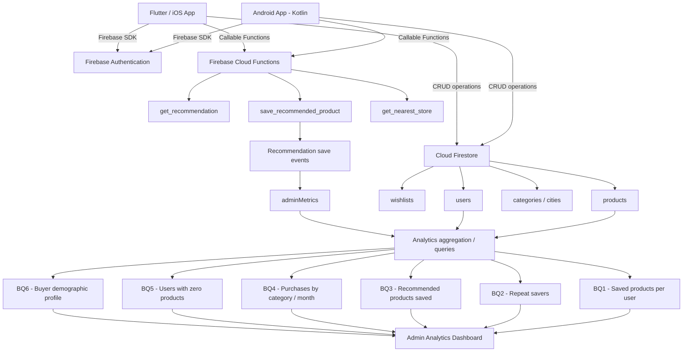
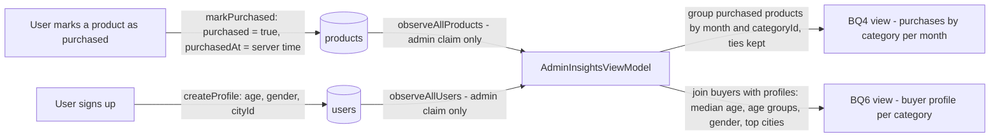
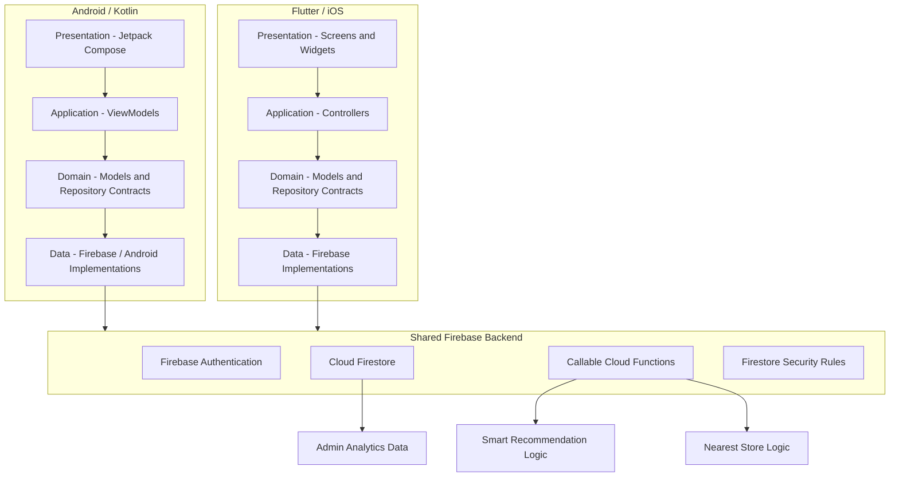
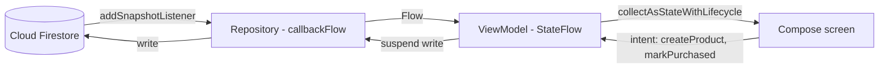

# Sprint 2 – App Implementation

**Course:** ISIS-3510 – Construcción de Aplicaciones Móviles  
**Team:** 13 – WhyNot  
**Members:** Juliana Duran, Santiago Casasbuenas, Martin Riveira, Jeronimo Franco, Juan Felipe Saenz, Miguel Angel Velandia  

---

## 1. Project Repositories

| Repository | Purpose | Link |
|---|---|---|
| Wiki | Course documentation and evidence | https://github.com/Moviles-G13-S1/wiki |
| Kotlin frontend | Native Android application | https://github.com/Moviles-G13-S1/whynot-front-kotlin |
| Flutter frontend | Flutter/iOS application | https://github.com/Moviles-G13-S1/whynot-front-flutter |
| Backend | Shared Firebase backend, rules, Cloud Functions and scripts | https://github.com/Moviles-G13-S1/whynot-back |


---

# 2. Business Questions

The following Business Questions are implemented as part of the Sprint 2 analytics functionality. The system uses application data stored in Firebase to calculate and expose these metrics through the administrator interfaces.

| # | Business Question | Type | Responsible member | Rationale | Main data source / implementation |
|---|---|---|---|---|---|
| BQ1 | How many products has a user saved? | Type 2 | Juan Felipe Saenz (Kotlin implementation) | Measures adoption and engagement with one of the core features of WhyNot and allows administrators to understand how actively users use their wishlists. | `products` collection grouped by `ownerId`; `AdminViewModel`, `FirebaseAdminRepository` and Admin Saved Products view. |
| BQ2 | How many users save another product after their first one? | Type 2 / Type 3 | *TBD* | Helps identify whether users continue interacting with the application after their first save and provides an indication of repeated engagement. | `products` collection grouped by `ownerId`; repeat-save analysis. |
| BQ3 | How many recommended products have been saved? | Type 3 | Juan Felipe Saenz | Measures whether the Smart Recommendation feature generates meaningful user actions instead of only displaying recommendations. | `get_recommendation` + `save_recommended_product`; recommendation events and `adminMetrics`. |
| BQ4 | Which category has the highest number of products marked as purchased per month? | Type 4 | Miguel Angel Velandia (Kotlin implementation) | Helps identify which product categories generate the highest purchasing activity over time and supports category-level analysis. | Purchased `products`, using `purchasedAt` and `categoryId`; `AdminInsightsViewModel`, `PurchasedProductsStats` and Admin Purchases view (`AdminPurchasesByCategoryScreen`). |
| BQ5 | How many users have 0 products saved? | Type 2 / Type 3 | *TBD* | Identifies registered users who have not yet adopted the application's main product-saving functionality and can be used as an activation indicator. | `users` collection compared with product owners; Admin Saved Products / Zero Products metric. |
| BQ6 | What is the demographic profile of the average buyer per category? | Type 4 | Miguel Angel Velandia (Kotlin implementation) | Helps characterize buyers by category using demographic information and purchasing activity, supporting a better understanding of the application's users. | Purchased products joined with user profiles; age, gender and city information; `AdminInsightsViewModel`, `DemographicProfileStats` and Admin Demographics view (`AdminDemographicProfileScreen`). |

### 2.1 Changes from Sprint 1 BQs

The following questions correspond directly to questions already defined during Sprint 1:

- **BQ1:** How many products has a user saved?
- **BQ4:** Which category has the highest number of products marked as purchased per month?
- **BQ6:** What is the demographic profile of the average buyer per category?

For BQ2, BQ3 and BQ5, the team refined some of the Business Questions originally defined in Sprint 1. These changes were not made as a result of external feedback, but as part of an internal review of the analytics scope. The objective was to keep the questions aligned with the same business goals defined in Sprint 1 while making them more specific, measurable, and directly connected to the user interactions and features implemented in WhyNot.

- **BQ2 change note:** BQ2, *"How many users save another product after their first one?"*, was derived from the Sprint 1 question *"How many products has a user saved?"*. The original question measured general engagement through the number of saved products, while the refined version focuses specifically on whether users continue using the core saving functionality after their first interaction. This makes it possible to measure repeated engagement instead of only observing the total number of saved products.

- **BQ3 change note:** BQ3, *"How many recommended products have been saved?"*, was defined as a more specific way of measuring the usage and effectiveness of one of the application's main features. It is related to the Sprint 1 Type 3 question *"Which features are less used?"*, but narrows the analysis to the recommendation feature introduced in the implemented solution. Instead of comparing all features at once, the refined question measures a concrete interaction: whether a recommendation generated by the system results in the user saving that product.

- **BQ5 change note:** BQ5, *"How many users have 0 products saved?"*, was also derived from the Sprint 1 question *"How many products has a user saved?"*. While the original question focuses on the number of products saved by active users, the refined version identifies registered users who have not yet used the application's main saving functionality. This provides an additional perspective on adoption by identifying users who have not completed the core product-saving action.

---

# 3. Analytics Pipeline

WhyNot uses Firebase as the shared backend for both mobile applications. Operational data is generated by normal user interactions, stored in Firestore, and then processed either directly by the administrator repositories or by backend Cloud Functions depending on the Business Question.



### 3.1 Pipeline rationale

The analytics pipeline reuses the application's operational Firebase data instead of introducing a second database or analytics server. This keeps the architecture small enough for the project while allowing both mobile platforms to share the same definitions and backend data.

Most BQs are calculated from Firestore data available to authenticated administrator accounts. BQ3 is different because saving a recommendation must be distinguished from manually saving a product. For that reason, the recommendation save flow is handled through backend logic and updates a separate analytics metric.

For BQ3, the backend-controlled flow preserves a `recommendationEventId` from the recommendation response and uses it when `save_recommended_product` is executed. This allows the system to distinguish a product saved from the Smart Recommendation feature from a normal manual product save and to update the BQ3 metric only through the recommendation-save flow.

**Juan Felipe Saenz's contribution:** implemented the backend tracking required for BQ3, updated the backend data contract, extended the Smart Feature test script, created a production BQ3 validation script, and implemented the Kotlin recommendation repository/ViewModel integration that consumes `get_recommendation` and `save_recommended_product`.

**Miguel Angel Velandia's contribution:** implemented BQ4 and BQ6 in the Kotlin administrator dashboard (`AdminInsightsViewModel`, `PurchasedProductsStats`, `DemographicProfileStats`, and the Purchases and Demographics views), and the client-side writes those metrics depend on: the one-way purchase that stamps `purchasedAt` with the server time (`markPurchased`) and the `cityId` stored at sign-up, which BQ6 groups by.

### 3.2 BQ4 and BQ6 pipeline (Kotlin)



**Rationale.**

- Both metrics are computed in memory from two real-time reads of `products` and `users`, which the Security Rules allow only to accounts carrying the `admin` custom claim. This needs no aggregation documents and no additional Cloud Function, and the views update on their own when a product is purchased or deleted.
- `purchasedAt` is written only by the one-way saved-to-purchased transition, and the rules require it to equal the server time of the request. A purchase therefore cannot be dated by the device clock or moved between months by toggling it.
- The shared index manifest is empty, so no query uses `orderBy`; grouping and sorting happen in the ViewModel. The 6, 12 and 24-month selector changes the window in memory without reading Firestore again.
- Edge cases are reported instead of hidden: purchases made before `purchasedAt` existed are shown as undated, categories tied for the lead are shown as a tie, each buyer is counted once per category, and buyers whose profile predates the city catalog are grouped as "No city set".
- Deleting a product removes it from both metrics, the same rule every product-based metric in the project follows.

*Additional pipeline rationale required by the team:* *TBD*

---

# 4. Architectural Design

## 4.1 Overall Architecture

WhyNot uses two independent mobile frontends connected to one shared Firebase backend. The applications share the same data contract, authentication model, Firestore collections, security rules, Cloud Functions and analytics definitions, while keeping platform-specific UI and device integrations separate.



## 4.2 Component interaction

A normal data operation follows the layered flow below:

```text
Screen / View
    ↓
Controller or ViewModel
    ↓
Repository interface
    ↓
Firebase repository implementation
    ↓
Firebase Authentication / Firestore / Cloud Function
```

Screens do not directly own the shared persistence logic. Instead, they delegate actions to an application-level controller or ViewModel, which uses repository contracts. This separation allows the application to replace Firebase implementations with fakes during tests and keeps backend-specific logic outside the UI layer.

For shared business behavior such as recommendations or nearby-store selection, the frontend repository calls the corresponding backend Cloud Function. The business rule is therefore implemented once in the backend instead of being duplicated independently in Kotlin and Flutter.

## 4.3 Patterns and architectural tactics

| Pattern / tactic | Where it is used | Rationale | Responsible member |
|---|---|---|---|
| Repository Pattern | Kotlin and Flutter data/domain layers | Separates domain contracts from Firebase implementations, improves testability and prevents screens from depending directly on Firebase SDK calls. | Miguel Angel Velandia (Kotlin Auth, User, Wishlist and Product repositories `33c05e5`; Location and first Recommendation repositories `7fe1f7a`; Speech repository contract and Android implementation `6557ebc`) / Juan Felipe Saenz (Kotlin Admin and Nearby store repositories `d6c091e`; Recommendation repository rewrite `c8ba47c`) / *TBD Flutter owner* |
| Layered / MVC-inspired architecture | Flutter features | Separates presentation, application/controller, domain and data responsibilities. | *TBD* |
| Layered architecture (feature-first) | Kotlin features: `domain`, `data`, `application`, `ui` and `core/di` | Each feature keeps its models and repository contracts apart from the Firebase and Android implementations and from the screens, so the UI never imports the Firebase SDK and every layer can be replaced or faked independently. | Miguel Angel Velandia (set up the structure and its first features: authentication, profile, wishlists and products, `33c05e5`) / Juan Felipe Saenz (Admin, Nearby, Recommendations and Speech modules) / *TBD remaining Kotlin owners* |
| ViewModel-based presentation architecture | Kotlin features | Keeps UI state and application logic outside Compose screens and allows the UI to react to structured state. | Miguel Angel Velandia (Auth, Profile, Wishlist, Product and Admin Insights ViewModels) / Juan Felipe Saenz (Admin, Nearby, Recommendations and Speech ViewModels; Profile screen integration) / *TBD remaining Kotlin owners* |
| Dependency Injection | `AppDependencies`, ViewModel factory and Flutter dependency scope | Centralizes the creation of repositories and makes it possible to replace real implementations with fakes during testing. | Miguel Angel Velandia (created the Kotlin `AppDependencies` composition root and `WhyNotViewModelFactory`, `33c05e5`) / Juan Felipe Saenz (registered the Admin, Nearby, Recommendation, Profile and Speech dependencies) / *TBD Flutter owner* |
| Authentication and authorization tactic | Firebase Authentication, custom `admin` claim, route guards and Security Rules | Restricts administrative functionality and sensitive data to authorized users. | Juan Felipe Saenz (Kotlin admin-access flow) / Miguel Angel Velandia (Kotlin Firebase Authentication integration and `admin` claim reading in `AuthRepository`) / *TBD backend and Flutter owners* |
| Idempotency tactic | Recommendation-save flow | Prevents the same recommendation event from being counted more than once in BQ3. | *TBD* |
| Privacy / data minimization tactic | Nearby Store functionality and voice input | Device coordinates are used as transient input and are not stored in the user's profile; coarse location is enough to pick the nearest store. Voice input keeps no audio: only the transcribed text reaches the app. | Miguel Angel Velandia (`AndroidLocationRepository`, `AndroidSpeechRecognitionRepository`) |
| Observer Pattern | Kotlin repositories, ViewModels and Compose screens: Firestore snapshot listeners wrapped in `callbackFlow`, exposed as `StateFlow` and collected by the screens | Screens react to data changes instead of re-reading: marking a purchase updates the lists and the admin metrics automatically, and each Firestore listener is removed when nothing observes it. | Miguel Angel Velandia |

### 4.4 Architecture rationale

The architecture centralizes shared business logic and security in the Firebase backend while allowing each platform to preserve its native UI architecture. This prevents recommendation and context-aware algorithms from producing different results on each platform and provides one source of truth for the data contract.

Repository contracts reduce coupling between the UI and Firebase. Authentication and administrator authorization are implemented at both navigation and backend/security-rule levels rather than relying only on whether an Admin button is visible. The use of fake repositories in tests also improves testability without requiring Firebase initialization for every unit test.

### 4.5 Juan Felipe Saenz – Architectural Contribution

contributed directly to the Kotlin layered architecture. His authored commits introduced repository contracts, Firebase-backed repository implementations, ViewModels, UI state objects, dependency wiring and fake repositories for the Admin Analytics, Nearby Stores and Smart Recommendations modules. He later added the real `FirebaseRecommendationRepository`, the speech-recognition repository/ViewModel layer, and profile/password integration.

For the Nearby feature, implemented the application/domain integration and the Firebase callable repository used to request `get_nearest_store`; the real Android device-location implementation was completed separately. This distinction keeps the sensor-specific implementation independent from the context-aware business flow.

The Repository Pattern is the clearest design pattern associated with this contribution: ViewModels depend on domain interfaces instead of Firebase classes directly. `AppDependencies` and `WhyNotViewModelFactory` provide the concrete implementations at the application boundary. This makes it possible to replace production repositories with fake implementations during automated tests.

### 4.6 Miguel Angel Velandia – Architectural Contribution

Connected the Kotlin client to the shared backend and set up the feature-first layered structure the Kotlin app follows: `domain` (models and repository contracts), `data` (Firebase and Android implementations), `application` (ViewModels) and `core/di` (composition root) — commit `33c05e5`. In that structure he created `AppDependencies` and `WhyNotViewModelFactory`, and the Firebase implementations of the Auth, User, Wishlist and Product repositories. He later added the device and callable repositories: `AndroidLocationRepository` and the first `FirebaseRecommendationRepository` (`7fe1f7a`), and `AndroidSpeechRecognitionRepository` (`6557ebc`).

**Design pattern – Observer.**



*Rationale.* Repositories expose Firestore data as `Flow`s instead of one-shot reads, ViewModels turn them into a `StateFlow`, and screens only observe that state and emit intents. A write anywhere reaches every observer: marking a product as purchased updates the wishlist, the Purchases view and the BQ4 metric without any manual refresh. Collection is lifecycle-aware, and `awaitClose` removes each snapshot listener when its collector stops, so screens that are not visible do not keep Firestore listeners open. The UI never calls the Firebase SDK directly.

*Device repositories.* Location and voice input follow the same contracts but talk to the device. Neither repository requests runtime permissions, because that needs an Activity; they throw typed errors (`LocationPermissionDeniedException`, `SpeechPermissionDeniedException`) that the screen turns into a request. `SpeechRecognizer` runs on the main thread and is released exactly once on result, error or cancellation, so leaving the screen switches the microphone off.

* others members Additional rationale for course-specific architectural decisions:* *TBD*

---

# 5. Implemented Functionalities

The Sprint 2 implementation includes the following functionality across the two mobile platforms.

| Functionality | Kotlin / Android | Flutter / iOS | Backend / service involved | Responsible member(s) |
|---|---|---|---|---|
| User authentication | Implemented | Implemented | Firebase Authentication | Juan Felipe Saenz (Kotlin authentication/profile UI and admin-access integration) / Miguel Angel Velandia (Kotlin Firebase Authentication integration: sign-in, and sign-up creating the account and its profile with `cityId`) / *TBD Flutter owner* |
| User profile | Implemented | Implemented | Firestore `users` | Juan Felipe Saenz (Kotlin profile screens, ViewModel integration and password flow) / Miguel Angel Velandia (`FirebaseUserRepository`, `ProfileViewModel` and city catalog) / *TBD Flutter owner* |
| Wishlist management | Implemented | Implemented | Firestore `wishlists` | Miguel Angel Velandia (Kotlin Wishlists, New Wishlist and Wishlist Detail views; `FirebaseWishlistRepository`, `WishlistViewModel`) / *TBD Flutter owner* |
| Manual product creation and management | Implemented | Implemented | Firestore `products` | Miguel Angel Velandia (Kotlin Why Not?, New Product and Product Detail views; `FirebaseProductRepository`, `ProductViewModel`) / *TBD Flutter owner* |
| Mark product as purchased | Implemented | Implemented | Firestore `products`, `purchased`, `purchasedAt` | Miguel Angel Velandia (Kotlin one-way `markPurchased` with server `purchasedAt`) / *TBD Flutter owner* |
| Admin analytics | Implemented | Implemented / final BQ mapping *TBD* | Firestore + `adminMetrics` | Juan Felipe Saenz (Kotlin BQ1 and BQ3 implementation) / Miguel Angel Velandia (Kotlin BQ4 and BQ6 implementation) / *TBD remaining owners* |
| Device location (input of the Context-Aware feature) | Implemented | Implemented | Device location services | Miguel Angel Velandia (Kotlin `AndroidLocationRepository` and location permissions) / *TBD Flutter owner* |
| Context-Aware feature: Nearby Stores | Implemented | Implemented | `get_nearest_store` Cloud Function | Juan Felipe Saenz (Kotlin repository/ViewModel integration) / Miguel Angel Velandia (Kotlin device location and dependency wiring) / *TBD backend and Flutter owners* |
| Smart feature: demographic recommendation | Implemented | Implemented | `get_recommendation` Cloud Function | Juan Felipe Saenz (Kotlin recommendation repository/ViewModel integration and BQ3 backend tracking) / Miguel Angel Velandia (first Kotlin `FirebaseRecommendationRepository` for `get_recommendation` and `save_recommended_product`, dependency wiring) / *TBD remaining owners* |
| Save a recommended product | Implemented | Implemented | `save_recommended_product` Cloud Function | Juan Felipe Saenz (backend BQ3 flow and Kotlin client integration) / Miguel Angel Velandia (first Kotlin client call to `save_recommended_product`) / *TBD Flutter owner* |
| Type 2 BQ functionality | Implemented | Implemented / evidence *TBD* | Firestore analytics | Juan Felipe Saenz (Kotlin BQ1 implementation) / Miguel Angel Velandia (`Product` and `UserProfile` models and the repositories that write the documents BQ1, BQ2 and BQ5 count; admin panel navigation) / *TBD remaining owners* |
| External/backend-connected functionality different from authentication | Implemented | Implemented | Firebase callable Cloud Functions | Juan Felipe Saenz (Kotlin Nearby callable repository and recommendation repository rewrite; BQ3 backend integration) / Miguel Angel Velandia (Kotlin Firestore integration of users, wishlists, products and categories; first recommendation callable repository) / *TBD remaining owners* |
| Sensor functionality: voice input (microphone) | Implemented | In progress: `feature/voice-input` branch, not yet merged into `master` | Platform speech recognition (`SpeechRecognizer` on Android) | Kotlin: Miguel Angel Velandia (speech repository contract, Android `SpeechRecognizer` implementation, `RECORD_AUDIO` permission and voice input in New Product) / Juan Felipe Saenz (`SpeechViewModel`, error states and tests) / Martin Riveira (`VoiceInputButton` and permission request). Flutter: Juliana Duran (`feature/voice-input`) / *TBD remaining Flutter owners* |

## 5.1 Minimum Sprint functionality mapping

| Sprint requirement | WhyNot implementation | Evidence |
|---|---|---|
| Uses at least one phone sensor | Microphone: voice input fills the product name and brand in the New Product form. Device location is presented under Context aware, so each requirement is answered by a different functionality. | Kotlin: Miguel `6557ebc` (PR #15) and `9e0521e` (PR #18), Juan Felipe `c8ba47c`, Martin `cf24c67` (PR #17). Flutter: Juliana, `feature/voice-input` branch (not yet merged into `master`). Demo link: *TBD*. |
| Answers Type 2 BQs | BQ1 / BQ2 / BQ5 analytics | BQ1 Kotlin implementation by Juan Felipe: `AdminViewModel.kt`, `FirebaseAdminRepository.kt`, `AdminSavedProductsScreen.kt`; direct commit `d6c091e`. Miguel created the `Product` and `UserProfile` domain models that `AdminRepository` returns, and the repositories that write the documents these metrics count: each product's `ownerId`, which BQ1 and BQ2 group by, and the profile created at sign-up, which BQ5 compares against product owners (`33c05e5`); he also extended the shared admin navigation in `AdminComponents.kt` and `AdminSavedProductsScreen.kt` (`7fe1f7a`). Additional BQ2/BQ5 evidence: *TBD*. |
| Context aware | Nearby Stores adapts results using the user's current location | Juan Felipe implemented the Kotlin `NearbyStoreViewModel`, domain contracts and `FirebaseNearbyStoreRepository` that calls `get_nearest_store` (`d6c091e`). Device-location implementation: Miguel's `AndroidLocationRepository` (`7fe1f7a`); demo evidence: *TBD*. |
| Smart feature | Product recommendation based on demographic similarity | Juan Felipe implemented the Kotlin recommendation ViewModel/contracts (`d6c091e`), rewrote `FirebaseRecommendationRepository` (`c8ba47c`) and implemented BQ3 backend recommendation-save tracking (`02d8006`). Miguel created the first `FirebaseRecommendationRepository` and wired it into the app (`7fe1f7a`). |
| User authentication | Email/password registration and login using Firebase Authentication | Juan Felipe authored Login/Register/Profile UI (`9ef345f`), Kotlin admin-access integration (`95d2ba3`) and real profile/password integration (`c8ba47c`). Miguel connected sign-in and sign-up to Firebase Authentication and Firestore profiles (`33c05e5`, `6eb38ce`). |
| External service / backend connection | Recommendations and Nearby Stores call Firebase Cloud Functions | Juan Felipe authored `FirebaseNearbyStoreRepository` (`d6c091e`), rewrote `FirebaseRecommendationRepository` (`c8ba47c`) and authored the backend BQ3 recommendation-save flow (`02d8006`). Miguel connected the app to Firestore (`33c05e5`) and created the first recommendation callable repository (`7fe1f7a`). |


# 6. Views Implemented by Each Member

Each member must be able to present, justify and explain at least one view implemented in the application.

| Member | Platform | View implemented | Evidence |
|---|---|---|---|
| Juliana Duran | *TBD* | *TBD* | *TBD* |
| Santiago Casasbuenas | *TBD* | *TBD* | *TBD* |
| Martin Riveira | *TBD* | *TBD* | *TBD* |
| Jeronimo Franco | *TBD* | *TBD* | *TBD* |
| Juan Felipe Saenz | Kotlin / Android | Login, Register, Profile, Edit Profile, Change Password | Direct commit `9ef345f` (`ui/screens/auth/LoginScreen.kt`, `RegisterScreen.kt`, `ui/screens/profile/ProfileScreen.kt`, `EditProfileScreen.kt`, `ChangePasswordScreen.kt`); profile/password integration refined in `c8ba47c`. |
| Miguel Angel Velandia | Kotlin / Android | Wishlists, New Wishlist, Wishlist Detail, Why Not? (add by link), New Product (with voice input), Product Detail; Admin Purchases (BQ4) and Admin Demographics (BQ6) | `7ec6870` and `75a64ee` (screens, shared components and routes), `33c05e5` (connected to Firebase), `7fe1f7a` (BQ4 and BQ6 views), `9e0521e` (voice input in New Product) |

---

# 7. Individual Contribution Mapping for Viva Voce

This table should be completed before the oral exam so that every team member can clearly identify the elements they are expected to explain.

| Member | BQ | View | Functionality | Architectural contribution | Design pattern | Evidence |
|---|---|---|---|---|---|---|
| Juliana Duran | *TBD* | *TBD* | *TBD* | *TBD* | *TBD* | *TBD* |
| Santiago Casasbuenas | *TBD* | *TBD* | *TBD* | *TBD* | *TBD* | *TBD* |
| Martin Riveira | *TBD* | *TBD* | *TBD* | *TBD* | *TBD* | *TBD* |
| Jeronimo Franco | *TBD* | *TBD* | *TBD* | *TBD* | *TBD* | *TBD* |
| Juan Felipe Saenz | BQ3 – Recommended products saved (also implemented BQ1 in Kotlin) | Login, Register, Profile, Edit Profile, Change Password | BQ3 recommendation-save analytics; Kotlin Smart Recommendation integration; authentication/profile; Nearby repository/ViewModel integration; speech-recognition architecture | Kotlin layered architecture using repository contracts, ViewModels and dependency injection | Repository Pattern | Direct commits: Kotlin `9ef345f`, `d6c091e`, `8fc6180`, `95d2ba3`, `c8ba47c`; Backend `02d8006`, `db1312b` |
| Miguel Angel Velandia | BQ4 – Purchases by category per month; BQ6 – Buyer demographic profile per category | Wishlists, Wishlist Detail, New Product (voice input), Product Detail; Admin Purchases and Demographics | Firebase integration of the Kotlin app (authentication, profiles, wishlists, products, one-way purchase); data models and data that BQ1, BQ2 and BQ5 count; device location for Nearby Stores; first recommendation callable repository; voice input (speech repository and New Product UI); BQ4 and BQ6 analytics | Kotlin feature-first layered architecture and composition root (`AppDependencies`, `WhyNotViewModelFactory`) | Observer Pattern | Kotlin `7ec6870`, `75a64ee`, `4c80578`, `33c05e5`, `6eb38ce`, `7fe1f7a`, `6557ebc`, `9e0521e`; Docs `0b8a611`, `f2e93c3` |

---

# 8. Ethics Video

**Required duration:** approximately 6 minutes.  
**Video link:** *TBD*  
**Slides / supporting material:** *TBD*  

The video should discuss ethical considerations associated with the functionality implemented during this sprint, especially topics related to user data, demographic recommendations, location, authentication, administrator access and analytics.

---

# 9. Collaboration and Repository Evidence

The project uses GitHub repositories and collaboration mechanisms to coordinate work across both mobile platforms and the shared backend.

## 9.1 Required evidence

- Issues used to assign and track work: *TBD – add link*
- GitHub Project / Kanban board: *TBD – add link*
- Sprint 2 milestone: *TBD – add link*
- Pull Requests: *TBD – add representative PR links*
- Pull Request reviews / approvals: *TBD – add links*
- Descriptive commits: *TBD – add examples*
- Evidence of contributions from all six members: *TBD*

## 9.2 Relevant implementation PRs already identified

- Kotlin PR #14 – BQ2, BQ5, Nearby Stores and Recommendations.
- Kotlin PR #4 – wishlists and products screens, shared components and routes (Miguel).
- Kotlin PR #7 – status bar and dropdown fixes on the wishlists and products screens (Miguel).
- Kotlin PR #8 – Kotlin app connected to the shared Firebase backend (Miguel).
- Kotlin PR #9 – profile city and one-way purchase aligned with the updated Security Rules (Miguel).
- Kotlin PR #13 – BQ4, BQ6 and related admin/location/recommendation integration (Miguel).
- Kotlin PR #15 – speech recognition repository and tie handling in BQ4 (Miguel).
- Kotlin PR #18 – voice input for product name and brand (Miguel).
- Backend PR #7 – tracking saved recommended products for BQ3.
- Backend PR #9 – nearest-store Cloud Function.
- Flutter PR #10 – users with zero saved products in admin analytics.
- Flutter PR #13 – recommended-products admin metric integration.
- *TBD – add remaining PRs that provide evidence for each member.*

### 9.3 Juan Felipe Saenz – Direct Authored Commit Evidence

The entries below are direct commits authored and committed by `jfsaenz`. Merge commits that only represent accepting another teammate's PR are intentionally excluded from this contribution list.

- **`41f60a3` – `Initialize Android project with Jetpack Compose`**: initial Kotlin/Android project structure, Compose theme/resources and Gradle setup.
- **`9ef345f` – `Implement auth and profile UI with shared design system`**: Login, Register, Profile, Edit Profile and Change Password screens; reusable UI components; color, theme and typography integration.
- **`9408de5` – `Esquema Kotlin listo`**: Kotlin project configuration updates in Gradle and the Android manifest.
- **`d6c091e` – `feat: add nearby recommendations and admin analytics`**: BQ1/BQ3 admin foundation, Nearby repository/ViewModel/domain integration, Recommendation repository contracts/ViewModel/domain integration, DI/ViewModel wiring and admin screens.
- **`8fc6180` – `test: add coverage and improve admin navigation`**: tests and fakes for Admin Analytics, Nearby Stores and Recommendations, plus admin navigation improvements.
- **`95d2ba3` – `feat: add admin access flow`**: Kotlin administrator-access flow through authentication, navigation and Profile.
- **`c8ba47c` – `Conecta perfil, cambio de contraseña, estados de voz y saludo del usuario`**: real profile/password integration, `FirebaseRecommendationRepository`, speech-recognition repository/ViewModel/error handling and related tests.
- **Backend `02d8006` – `feat: track saved recommended products for BQ3`**: BQ3 backend tracking, data-contract updates and Smart Feature test-script extension.
- **Backend `db1312b` – `error`**: additional BQ3 backend adjustments and `test-production-bq3/index.mjs` production validation script.

Direct commit links:

- https://github.com/Moviles-G13-S1/whynot-front-kotlin/commit/41f60a30e33b5ca4dd6f96459f780142b951d53d
- https://github.com/Moviles-G13-S1/whynot-front-kotlin/commit/9ef345f0685d6d35d5eefcc09d3ad56f0c6f1fcf
- https://github.com/Moviles-G13-S1/whynot-front-kotlin/commit/d6c091e9ab4dd7e313a53511c3788ba6570f6569
- https://github.com/Moviles-G13-S1/whynot-front-kotlin/commit/8fc61803568583f4621922bcf5dce4631dae7301
- https://github.com/Moviles-G13-S1/whynot-front-kotlin/commit/95d2ba32f786936dee9b78c67c0fc642cc6863f0
- https://github.com/Moviles-G13-S1/whynot-front-kotlin/commit/c8ba47c6130e3c49bb9a91ed3b9dc3a3274c6aad
- https://github.com/Moviles-G13-S1/whynot-back/commit/02d8006c2264819f42532b784d118b33ee43433a
- https://github.com/Moviles-G13-S1/whynot-back/commit/db1312b3b579a2b3f6c327161bda45d2e8347d49

### 9.4 Miguel Angel Velandia – Direct Authored Commit Evidence

The entries below are direct commits authored by Miguel Angel Velandia. Merge commits are excluded. Some of these files were later copied into or extended on other branches; `git log --full-history` shows the original commits, which plain `git log` can hide behind merges.

- **`7ec6870` – `Add wishlists and products screens and their shared components`**: Wishlists, New Wishlist, Wishlist Detail, New Product and Product Detail screens; `ProductCard`, `WishlistCard`, `CategoryChip` and `ProductImage` components.
- **`75a64ee` – `Add wishlists and products routes to the navigation graph`**: navigation for the wishlist and product flows, and the Why Not? (add by link) screen.
- **`4c80578` – `Fix status bar overlap and dropdown colors on wishlists and products screens`**: UI fixes found while testing on a device.
- **`33c05e5` – `Connect the app to the shared Firebase backend`**: layered structure (`domain`, `data`, `application`, `core/di`), `AppDependencies`, `WhyNotViewModelFactory`, Firebase Auth/User/Wishlist/Product repositories and their ViewModels.
- **`6eb38ce` – `Fix profile city and one-way purchase against the updated rules`**: `cityId` at sign-up and the one-way `markPurchased` with server `purchasedAt`.
- **`7fe1f7a` – `Add location and recommendation repositories and the purchases and demographics admin screens (BQ4 and BQ6)`**: `AndroidLocationRepository`, first `FirebaseRecommendationRepository`, `AdminInsightsViewModel`, BQ4 and BQ6 views, dependency wiring.
- **`6557ebc` – `Add speech recognition repository and show ties in the purchases metric`**: speech repository contract, `AndroidSpeechRecognitionRepository`, `RECORD_AUDIO` permission, and tie handling in BQ4.
- **`9e0521e` – `Add voice input for product name and brand`**: voice input in New Product, connecting the speech ViewModel and the microphone button.
- **Docs `0b8a611` and `f2e93c3`**: Kotlin frontend documentation in `whynot-docs`.

Direct commit links:

- https://github.com/Moviles-G13-S1/whynot-front-kotlin/commit/7ec68700b20d9f543b08751ce40877c50e693e92
- https://github.com/Moviles-G13-S1/whynot-front-kotlin/commit/75a64ee7ae469e0f23a5e715e9159aab18c898b0
- https://github.com/Moviles-G13-S1/whynot-front-kotlin/commit/4c805784086dad27fac74a112730302a6d4556b2
- https://github.com/Moviles-G13-S1/whynot-front-kotlin/commit/33c05e5071da693ed350ea8519a76860a1d38b9f
- https://github.com/Moviles-G13-S1/whynot-front-kotlin/commit/6eb38ce432718f33dcfb70573c1e18b3fe536a9b
- https://github.com/Moviles-G13-S1/whynot-front-kotlin/commit/7fe1f7a39c81fab1d1d412009cdc881e38cb2294
- https://github.com/Moviles-G13-S1/whynot-front-kotlin/commit/6557ebc9ef9b281f8cb85d0b71807fe1a2a78f32
- https://github.com/Moviles-G13-S1/whynot-front-kotlin/commit/9e0521ecfb8a39a516f14cd2ef7fedfdd82ad236
- https://github.com/Moviles-G13-S1/whynot-docs/commit/0b8a61118391e430e4ce23c4de3fff3c1449dfc3
- https://github.com/Moviles-G13-S1/whynot-docs/commit/f2e93c3cb8fd34179431c6ec62b92b7d2f14bf07

---

# 10. Testing and Validation

## Kotlin / Android

Existing automated tests include ViewModel tests for administrator analytics, Nearby Stores and Recommendations using fake repositories.

### Juan Felipe Saenz – Verified testing contribution

Juan Felipe directly authored the following test coverage:

- `features/admin/application/AdminViewModelTest.kt`
- `features/admin/fakes/FakeAdminRepository.kt`
- `features/nearby/application/NearbyStoreViewModelTest.kt`
- `features/nearby/fakes/FakeLocationRepository.kt`
- `features/nearby/fakes/FakeNearbyStoreRepository.kt`
- `features/recommendations/application/RecommendationViewModelTest.kt`
- `features/recommendations/fakes/FakeRecommendationRepository.kt`
- `features/profile/application/ProfileAndPasswordTest.kt`
- `features/speech/application/SpeechViewModelTest.kt`

These tests validate application behavior through repository abstractions and fake implementations where appropriate, without requiring the production Firebase backend for every unit test.

**Final test command/result:** *TBD*  
**Number of passing tests:** *TBD*  
**Build evidence:** *TBD*  

## Flutter / iOS

The Flutter project includes controller, repository and widget tests using in-memory/fake implementations.

**Final test command/result:** *TBD*  
**Number of passing tests:** *TBD*  
**Build evidence:** *TBD*  

## Backend

The backend includes Firestore Security Rules tests and scripts for validating the Smart and Context-Aware features.

Juan Felipe directly extended `scripts/test-smart-features/index.mjs` while implementing BQ3 and later added `scripts/test-production-bq3/index.mjs` to validate the recommendation-save metric against the deployed backend.

**Final test command/result:** *TBD*  
**Number of passing tests:** *TBD*  
**Deployment evidence:** *TBD*  

---

# 11. Final Submission Checklist

- [ ] All 6 BQs are listed with type, rationale and responsible member.
- [ ] BQ changes from Sprint 1 are explained where necessary.
- [ ] Analytics Pipeline diagram is included.
- [ ] Analytics Pipeline rationale is complete.
- [ ] Overall architecture diagram is included.
- [ ] Component interaction is explained.
- [ ] Design patterns and architectural tactics are listed.
- [ ] Every pattern/tactic has a responsible member.
- [ ] Every architecture diagram has a rationale.
- [ ] Implemented features are listed for both platforms.
- [ ] Every functionality has responsible member(s).
- [ ] Every member has at least one view to present.
- [ ] Every member has a BQ to explain.
- [ ] Every member has an architectural contribution and design pattern to explain.
- [ ] Sensor functionality is demonstrated.
- [ ] Type 2 BQ functionality is demonstrated.
- [ ] Context-Aware feature is demonstrated.
- [ ] Smart feature is demonstrated.
- [ ] Authentication is demonstrated.
- [ ] A non-authentication feature connected to the backend is demonstrated.
- [ ] Ethics video link is included.
- [ ] Issues, milestones, Project/Kanban and PR evidence are included.
- [ ] PR reviews/approvals are visible as collaboration evidence.
- [ ] Final tests/builds for Kotlin, Flutter and backend are recorded.
- [ ] All remaining `TBD` fields have been reviewed before submission.

---

# 12. References

- WhyNot Wiki: https://github.com/Moviles-G13-S1/wiki
- Kotlin frontend: https://github.com/Moviles-G13-S1/whynot-front-kotlin
- Flutter frontend: https://github.com/Moviles-G13-S1/whynot-front-flutter
- Backend: https://github.com/Moviles-G13-S1/whynot-back
- Architecture documentation: https://github.com/Moviles-G13-S1/whynot-docs
- Figma prototype: https://www.figma.com/design/GKjDHU7klmjGONACLHfg0O/WhyNot-IOS
- Ethics video: *TBD*
