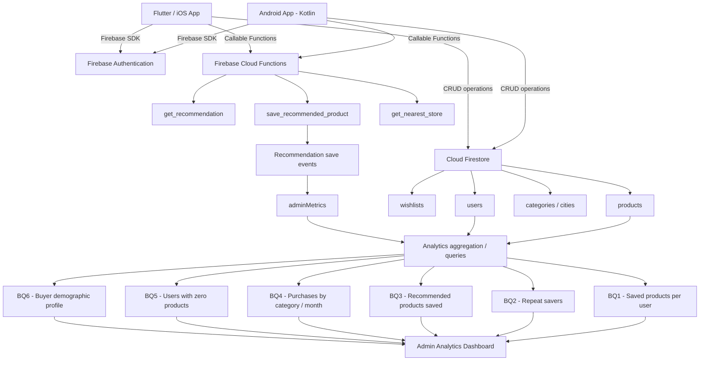
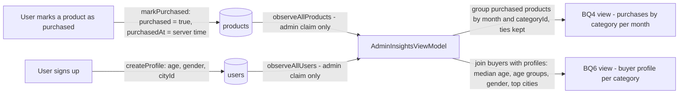
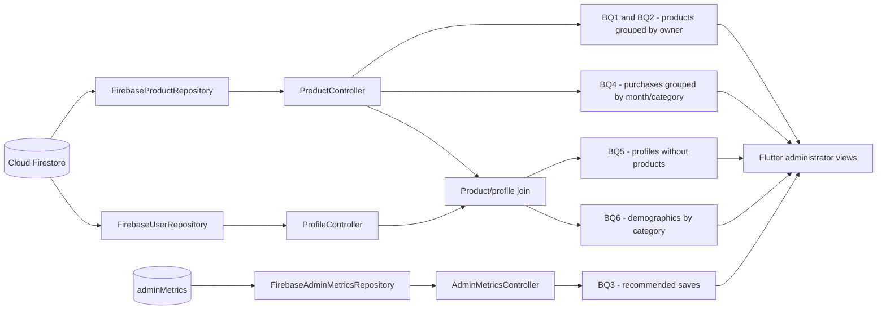
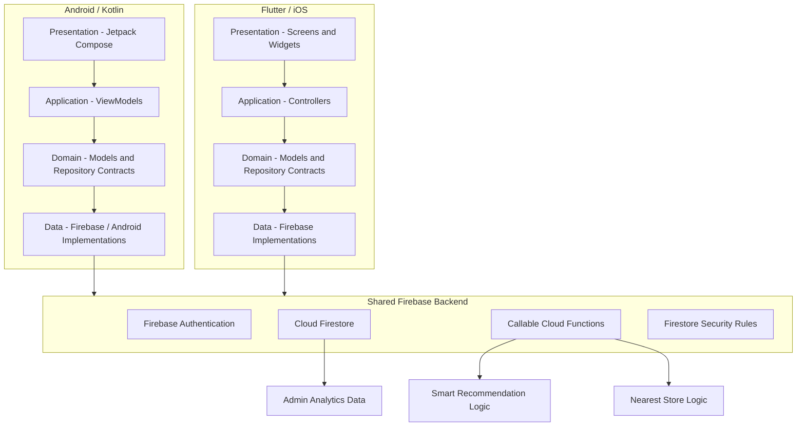
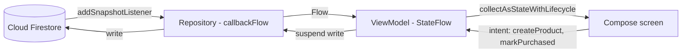
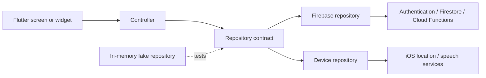

# Sprint 2 – App Implementation

**Course:** ISIS-3510 – Construcción de Aplicaciones Móviles  
**Team:** 13 – WhyNot  
**Members:** Juliana Duran, Santiago Casasbuenas, Martin Riveira, Jeronimo Franco, Juan Felipe Saenz, Miguel Angel Velandia  

---

## 1. Project Repositories

| Repository | Purpose | Link |
|---|---|---|
| Wiki | Course documentation and evidence | https://github.com/Moviles-G13-S1/wiki |
| Kotlin frontend | Native Android application | https://github.com/Moviles-G13-S1/whynot-front-kotlin |
| Flutter frontend | Flutter/iOS application | https://github.com/Moviles-G13-S1/whynot-front-flutter |
| Backend | Shared Firebase backend, rules, Cloud Functions and scripts | https://github.com/Moviles-G13-S1/whynot-back |


---

# 2. Business Questions

The following Business Questions are implemented as part of the Sprint 2 analytics functionality. The system uses application data stored in Firebase to calculate and expose these metrics through the administrator interfaces.

| # | Business Question | Type | Responsible member | Rationale | Main data source / implementation |
|---|---|---|---|---|---|
| BQ1 | How many products has a user saved? | Type 2 | Juan Felipe Saenz (Kotlin) and Jeronimo Franco (Flutter) | Measures adoption and engagement with one of the core features of WhyNot and allows administrators to understand how actively users use their wishlists. | `products` grouped by `ownerId`. Kotlin: `AdminViewModel`, `FirebaseAdminRepository` and Admin Saved Products. Flutter: real-data aggregation in `76afa227`, displayed in the admin view originally created in `3b5f770`. |
| BQ2 | How many users save another product after their first one? | Type 2 | Juliana Duran (documentation/presentation and Flutter product-save flow), Martin Riveira (Kotlin) and Jeronimo Franco (Flutter metric) | Measures repeated engagement by separating users who saved exactly one product from users who returned to save two or more. | `products` grouped by `ownerId`; Kotlin implementation in PR #14. Flutter aggregation in `76afa227`; the product flows that generate the underlying records were implemented in `d1ec7b6`, `6b8e178` and `83b7bd8`. |
| BQ3 | How many recommended products have been saved? | Type 3 | Juan Felipe Saenz (BQ3 backend and later Kotlin repository rewrite/integration), Miguel Angel Velandia (initial Kotlin recommendation callable repository) and Santiago Casasbuenas (Flutter administrator metric) | Measures whether the Smart Recommendation feature generates meaningful user actions instead of only displaying recommendations. | `get_recommendation` + `save_recommended_product`; recommendation events and `adminMetrics`. Backend commits `02d8006`, `db1312b`; Flutter aggregate repository/controller/view in `df09c88`. |
| BQ4 | Which category has the highest number of products marked as purchased per month? | Type 4 | Miguel Angel Velandia (Kotlin) and Jeronimo Franco (Flutter) | Helps identify which product categories generate the highest purchasing activity over time and supports category-level analysis. | Purchased `products` using `purchasedAt` and `categoryId`. Kotlin: `AdminInsightsViewModel` and Admin Purchases. Flutter: real-time monthly/category grouping and 6/12/24-month view in `76afa227`. |
| BQ5 | How many users have 0 products saved? | Type 2 | Martin Riveira (Kotlin) and Jeronimo Franco (Flutter) | Identifies registered users who have not yet adopted the application's main product-saving functionality and can be used as an activation indicator. | `users` compared with product owners. Kotlin implementation in PR #14. Flutter profile/product join and zero-product card in `061500f`, PR #10. |
| BQ6 | What is the demographic profile of the average buyer per category? | Type 4 | Miguel Angel Velandia (Kotlin) and Jeronimo Franco (Flutter) | Helps characterize buyers by category using demographic information and purchasing activity, supporting a better understanding of the application's users. | Purchased products joined with user profiles, category and city catalogs. Kotlin: `AdminInsightsViewModel` and Admin Demographics. Flutter: `DemographicSummary` and real-data view in `76afa227`, covered by `demographic_summary_test.dart`. |

The responsible-member column records who can explain and defend each BQ and
who contributed its implementation. Some questions deliberately have one
owner per platform because both applications expose the same shared business
question through independent client implementations. Shared ownership does
not mean that every listed member authored every layer of the feature; the
evidence column identifies the concrete contribution.

### 2.1 Changes from Sprint 1 BQs

The following questions correspond directly to questions already defined during Sprint 1:

- **BQ1:** How many products has a user saved?
- **BQ4:** Which category has the highest number of products marked as purchased per month?
- **BQ6:** What is the demographic profile of the average buyer per category?

For BQ2, BQ3 and BQ5, the team refined some of the Business Questions originally defined in Sprint 1. These changes were not made as a result of external feedback, but as part of an internal review of the analytics scope. The objective was to keep the questions aligned with the same business goals defined in Sprint 1 while making them more specific, measurable, and directly connected to the user interactions and features implemented in WhyNot.

- **BQ2 change note:** BQ2, *"How many users save another product after their first one?"*, was derived from the Sprint 1 question *"How many products has a user saved?"*. The original question measured general engagement through the number of saved products, while the refined version focuses specifically on whether users continue using the core saving functionality after their first interaction. This makes it possible to measure repeated engagement instead of only observing the total number of saved products.

- **BQ3 change note:** BQ3, *"How many recommended products have been saved?"*, was defined as a more specific way of measuring the usage and effectiveness of one of the application's main features. It is related to the Sprint 1 Type 3 question *"Which features are less used?"*, but narrows the analysis to the recommendation feature introduced in the implemented solution. Instead of comparing all features at once, the refined question measures a concrete interaction: whether a recommendation generated by the system results in the user saving that product.

- **BQ5 change note:** BQ5, *"How many users have 0 products saved?"*, was also derived from the Sprint 1 question *"How many products has a user saved?"*. While the original question focuses on the number of products saved by active users, the refined version identifies registered users who have not yet used the application's main saving functionality. This provides an additional perspective on adoption by identifying users who have not completed the core product-saving action.

---

# 3. Analytics Pipeline

WhyNot uses Firebase as the shared backend for both mobile applications. Operational data is generated by normal user interactions, stored in Firestore, and then processed either directly by the administrator repositories or by backend Cloud Functions depending on the Business Question.



### 3.1 Pipeline rationale

The analytics pipeline reuses the application's operational Firebase data instead of introducing a second database or analytics server. This keeps the architecture small enough for the project while allowing both mobile platforms to share the same definitions and backend data.

Most BQs are calculated from Firestore data available to authenticated administrator accounts. BQ3 is different because saving a recommendation must be distinguished from manually saving a product. For that reason, the recommendation save flow is handled through backend logic and updates a separate analytics metric.

For BQ3, the backend-controlled flow preserves a `recommendationEventId` from the recommendation response and uses it when `save_recommended_product` is executed. This allows the system to distinguish a product saved from the Smart Recommendation feature from a normal manual product save and to update the BQ3 metric only through the recommendation-save flow.

**Juan Felipe Saenz's contribution:** implemented the backend tracking required for BQ3, updated the backend data contract, extended the Smart Feature test script, created a production BQ3 validation script, implemented the Kotlin recommendation ViewModel/contracts, and later rewrote and integrated `FirebaseRecommendationRepository` to consume `get_recommendation` and `save_recommended_product`. The first Kotlin `FirebaseRecommendationRepository` had been created earlier by Miguel Angel Velandia in `7fe1f7a`.

**Miguel Angel Velandia's contribution:** implemented BQ4 and BQ6 in the Kotlin administrator dashboard (`AdminInsightsViewModel`, `PurchasedProductsStats`, `DemographicProfileStats`, and the Purchases and Demographics views), and the client-side writes those metrics depend on: the one-way purchase that stamps `purchasedAt` with the server time (`markPurchased`) and the `cityId` stored at sign-up, which BQ6 groups by.

**Flutter team's contribution:** Santiago Casasbuenas created the administrator views and later connected BQ3 to the backend-controlled `adminMetrics` aggregate. Jeronimo Franco replaced placeholder analytics with real Firestore-backed calculations for BQ1, BQ2, BQ4 and BQ6, and added the BQ5 users-with-zero-products calculation. Juliana Duran implemented the product, Smart Recommendation and profile flows that produce or consume the operational data used by the pipeline. This division reflects a consistent team effort across presentation, application, data and device/backend integration rather than isolated screens.

### 3.2 BQ4 and BQ6 pipeline (Kotlin)



**Rationale.**

- Both metrics are computed in memory from two real-time reads of `products` and `users`, which the Security Rules allow only to accounts carrying the `admin` custom claim. This needs no aggregation documents and no additional Cloud Function, and the views update on their own when a product is purchased or deleted.
- `purchasedAt` is written only by the one-way saved-to-purchased transition, and the rules require it to equal the server time of the request. A purchase therefore cannot be dated by the device clock or moved between months by toggling it.
- The shared index manifest is empty, so no query uses `orderBy`; grouping and sorting happen in the ViewModel. The 6, 12 and 24-month selector changes the window in memory without reading Firestore again.
- Edge cases are reported instead of hidden: purchases made before `purchasedAt` existed are shown as undated, categories tied for the lead are shown as a tie, each buyer is counted once per category, and buyers whose profile predates the city catalog are grouped as "No city set".
- Deleting a product removes it from both metrics, the same rule every product-based metric in the project follows.

### 3.3 Flutter analytics pipeline



**Rationale.** Flutter reads operational collections through repository
contracts and exposes them through controllers, keeping Firebase imports out
of presentation widgets. BQ1, BQ2, BQ4, BQ5 and BQ6 are derived from live
product/profile streams because their source records already exist in
Firestore and administrators are authorized to list them. BQ3 instead reads
the backend-controlled `adminMetrics` aggregate so the client cannot count a
manual save as a recommendation save. The Flutter and Kotlin implementations
therefore share the same data contract and BQ definitions while retaining
platform-native state and UI layers.

The client-side calculations intentionally contain no second persistence
model: deleting a product removes it from product-based metrics, and a new
snapshot refreshes every active administrator view. The architecture is
appropriate for the current project scale; a production system with larger
datasets would move these aggregations to backend-maintained summaries to
avoid downloading complete administrator collections.

---

# 4. Architectural Design

## 4.1 Overall Architecture

WhyNot uses two independent mobile frontends connected to one shared Firebase backend. The applications share the same data contract, authentication model, Firestore collections, security rules, Cloud Functions and analytics definitions, while keeping platform-specific UI and device integrations separate.



## 4.2 Component interaction

A normal data operation follows the layered flow below:

```text
Screen / View
    ↓
Controller or ViewModel
    ↓
Repository interface
    ↓
Firebase repository implementation
    ↓
Firebase Authentication / Firestore / Cloud Function
```

Screens do not directly own the shared persistence logic. Instead, they delegate actions to an application-level controller or ViewModel, which uses repository contracts. This separation allows the application to replace Firebase implementations with fakes during tests and keeps backend-specific logic outside the UI layer.

For shared business behavior such as recommendations or nearby-store selection, the frontend repository calls the corresponding backend Cloud Function. The business rule is therefore implemented once in the backend instead of being duplicated independently in Kotlin and Flutter.

## 4.3 Patterns and architectural tactics

| Pattern / tactic | Where it is used | Rationale | Responsible member |
|---|---|---|---|
| Repository Pattern | Kotlin and Flutter data/domain layers | Separates domain contracts from Firebase/device implementations, improves testability and prevents screens from depending directly on SDK calls. | Kotlin: Miguel Angel Velandia and Juan Felipe Saenz. Flutter: Santiago Casasbuenas established the shared repository/controller boundaries in `83b7bd8`; Juliana Duran applied them to Nearby, Recommendation and Speech in `cc8d213` and `de9971c`; Jeronimo Franco extended the Firebase-backed profile, city, product and analytics flows in `76afa227`. |
| Layered / MVC-inspired architecture | Flutter features (`presentation`, `application`, `domain`, `data`) | Keeps widgets focused on rendering and user intent, controllers focused on application state, contracts independent from Firebase, and SDK calls in data implementations. | Santiago Casasbuenas (cross-feature refactor and dependency boundary, `83b7bd8`); Juliana Duran (Smart, Context-Aware and Speech modules); Jeronimo Franco (real-data analytics/profile integration). |
| Layered architecture (feature-first) | Kotlin features: `domain`, `data`, `application`, `ui` and `core/di` | Each feature keeps its models and repository contracts apart from Firebase/Android implementations and screens so layers can be replaced or faked independently. | Miguel Angel Velandia (initial structure and first connected features, `33c05e5`), Juan Felipe Saenz (Admin, Nearby, Recommendations and Speech application/domain integration), and Martin Riveira (Home/Purchases presentation, BQ2/BQ5 and voice-input presentation component). |
| ViewModel-based presentation architecture | Kotlin features | Keeps UI state and application logic outside Compose screens and allows the UI to react to structured state. | Miguel Angel Velandia (Auth, Profile, Wishlist, Product and Admin Insights ViewModels), Juan Felipe Saenz (Admin, Nearby, Recommendations and Speech ViewModels), and Martin Riveira (Home/Purchases and feature presentation integration). |
| Dependency Injection | Kotlin `AppDependencies`/ViewModel factory and Flutter `AppDependencies`/`DependenciesScope` | Centralizes repository construction and makes it possible to replace production integrations with fakes in automated tests. | Kotlin: Miguel Angel Velandia and Juan Felipe Saenz. Flutter: Santiago Casasbuenas introduced the composition/dependency scope in `83b7bd8`; Juliana Duran registered location, Nearby, Recommendation and Speech dependencies; Jeronimo Franco registered city/profile analytics dependencies. |
| Authentication and authorization tactic | Firebase Authentication, custom `admin` claim, route guards and Security Rules | Restricts administrative functionality and sensitive data at both navigation and backend boundaries. | Kotlin: Juan Felipe Saenz and Miguel Angel Velandia. Flutter/backend: Santiago Casasbuenas implemented Flutter route guards and the original admin rules/role scripts (`1ca1414`, backend PRs #1/#2); Juliana Duran integrated Firebase Auth; Jeronimo Franco aligned profile/city reads with the rules. |
| Idempotency tactic | Recommendation-save flow | Prevents the same recommendation event from being counted more than once in BQ3. | Juan Felipe Saenz implemented the backend event tracking and idempotent save path (`02d8006`, `db1312b`); the Kotlin client preserves the event ID. Flutter reads the resulting aggregate but does not currently execute this save flow. |
| Privacy / data minimization tactic | Nearby Store functionality and voice input | Coordinates are transient and not stored in the profile; microphone audio is not persisted and only transcribed text reaches the form. | Kotlin: Miguel Angel Velandia. Flutter: Juliana Duran (`GeolocatorLocationRepository`, `DeviceSpeechRecognitionRepository`) and Jeronimo Franco (iOS permission declarations for location). |
| Observer / reactive presentation | Kotlin `Flow`/`StateFlow`; Flutter Firestore streams and `StreamBuilder` | Screens react to backend snapshots rather than owning persistence or manually refreshing metrics. | Kotlin: Miguel Angel Velandia. Flutter: Santiago Casasbuenas established controller/repository streams; Jeronimo Franco connected administrator views to real product/profile streams. |

### 4.4 Architecture rationale

The architecture centralizes shared business logic and security in the Firebase backend while allowing each platform to preserve its native UI architecture. This prevents recommendation and context-aware algorithms from producing different results on each platform and provides one source of truth for the data contract.

Repository contracts reduce coupling between the UI and Firebase. Authentication and administrator authorization are implemented at both navigation and backend/security-rule levels rather than relying only on whether an Admin button is visible. The use of fake repositories in tests also improves testability without requiring Firebase initialization for every unit test.

### 4.5 Juan Felipe Saenz – Architectural Contribution

Juan Felipe Saenz contributed directly to the Kotlin layered architecture. His authored commits introduced repository contracts, Firebase-backed implementations for Admin Analytics and Nearby Stores, ViewModels, UI state objects, dependency wiring and fake repositories for the Admin Analytics, Nearby Stores and Smart Recommendations modules. He later rewrote `FirebaseRecommendationRepository` (originally created by Miguel Angel Velandia in `7fe1f7a`), added `SpeechViewModel`, speech UI/error states and tests on top of Miguel's speech repository (`SpeechRecognitionRepository`, `AndroidSpeechRecognitionRepository` and `SpeechErrors`, originally created in `6557ebc`), added error handling around `startListening`, and integrated the profile and password flows.

For the Nearby feature, Juan Felipe implemented the application/domain integration and the Firebase callable repository used to request `get_nearest_store`; the real Android device-location implementation (`AndroidLocationRepository`) was completed by Miguel Angel Velandia in `7fe1f7a`. This distinction keeps the device-specific implementation independent from the context-aware business flow.

The Repository Pattern is the clearest design pattern associated with this contribution: ViewModels depend on domain interfaces instead of Firebase classes directly. `AppDependencies` and `WhyNotViewModelFactory` provide the concrete implementations at the application boundary. This makes it possible to replace production repositories with fake implementations during automated tests.

### 4.6 Miguel Angel Velandia – Architectural Contribution

Connected the Kotlin client to the shared backend and set up the feature-first layered structure the Kotlin app follows: `domain` (models and repository contracts), `data` (Firebase and Android implementations), `application` (ViewModels) and `core/di` (composition root) — commit `33c05e5`. In that structure he created `AppDependencies` and `WhyNotViewModelFactory`, and the Firebase implementations of the Auth, User, Wishlist and Product repositories. He later added the device and callable repositories: `AndroidLocationRepository` and the first `FirebaseRecommendationRepository` (`7fe1f7a`), and `AndroidSpeechRecognitionRepository` (`6557ebc`).

**Design pattern – Observer.**



*Rationale.* Repositories expose Firestore data as `Flow`s instead of one-shot reads, ViewModels turn them into a `StateFlow`, and screens only observe that state and emit intents. A write anywhere reaches every observer: marking a product as purchased updates the wishlist, the Purchases view and the BQ4 metric without any manual refresh. Collection is lifecycle-aware, and `awaitClose` removes each snapshot listener when its collector stops, so screens that are not visible do not keep Firestore listeners open. The UI never calls the Firebase SDK directly.

*Device repositories.* Location and voice input follow the same contracts but talk to the device. Neither repository requests runtime permissions, because that needs an Activity; they throw typed errors (`LocationPermissionDeniedException`, `SpeechPermissionDeniedException`) that the screen turns into a request. `SpeechRecognizer` runs on the main thread and is released exactly once on result, error or cancellation, so leaving the screen switches the microphone off.

### 4.7 Flutter Team – Architectural Contribution

The Flutter client uses a feature-first layered structure. Santiago Casasbuenas
introduced the shared application boundary (`AppDependencies`,
`DependenciesScope`, controllers, repository contracts and Firebase data
implementations) across authentication, profile, wishlists and products in
`83b7bd8`. Juliana Duran used the same structure for the Smart Recommendation,
Nearby Store and Speech features (`cc8d213`, `de9971c`). Jeronimo Franco
connected administrator analytics, city catalogs and profile creation to real
backend data while preserving those boundaries (`76afa227`, `01222cc`).



**Rationale.** Controllers and widgets depend on domain contracts rather than
Firebase, Geolocator or `speech_to_text` classes. Production repositories are
created once by `AppDependencies`; widget/controller tests provide in-memory
implementations through the same contracts. This supports independent feature
development by the three Flutter contributors, keeps platform permissions and
SDK failure handling at the data boundary, and prevents administrator or
business rules from being embedded in UI components.

The architecture also separates shared and platform-specific decisions.
Recommendation ranking and nearest-store selection run in Cloud Functions so
both apps receive the same answer. Flutter retains ownership of iOS
permissions, lifecycle behavior and presentation. For voice input, leaving the
product form cancels an active recognition session, and only the returned text
is inserted into the selected field; WhyNot does not persist microphone audio.

---

# 5. Implemented Functionalities

The Sprint 2 implementation includes the following functionality across the two mobile platforms.

| Functionality | Kotlin / Android | Flutter / iOS | Backend / service involved | Responsible member(s) |
|---|---|---|---|---|
| User authentication | Implemented | Implemented | Firebase Authentication | Kotlin: Juan Felipe Saenz (authentication/profile UI and admin-access integration) and Miguel Angel Velandia (Firebase Authentication integration and sign-up with `cityId`). Flutter: Jeronimo Franco (initial Login and Create Account views), Juliana Duran (Firebase integration), and Santiago Casasbuenas (`AuthController`, repository boundary and admin route guard), commits `50c7be4`, `4276d98`, `6b8e178`, `1ca1414` and `83b7bd8`. |
| User profile | Implemented | Implemented | Firestore `users` | Kotlin: Juan Felipe Saenz (profile screens, ViewModel integration and password flow) and Miguel Angel Velandia (`FirebaseUserRepository`, `ProfileViewModel` and city catalog). Flutter: Jeronimo Franco (Profile view, real city/profile integration and account-creation fixes), Juliana Duran (Firebase-connected profile screens), and Santiago Casasbuenas (profile controller/repository refactor), commits `09a7c65`, `6b8e178`, `83b7bd8`, `76afa227` and `01222cc`. |
| Wishlist management | Implemented | Implemented | Firestore `wishlists` | Kotlin: Miguel Angel Velandia (Wishlists, New Wishlist and Wishlist Detail views; `FirebaseWishlistRepository`, `WishlistViewModel`). Flutter: Juliana Duran (Wishlist views and Firebase integration) and Santiago Casasbuenas (feature-first controller, repository contract, Firebase implementation and test fakes), commits `d1ec7b6`, `6b8e178` and `83b7bd8`. |
| Manual product creation and management | Implemented | Implemented | Firestore `products` | Kotlin: Miguel Angel Velandia (Why Not?, New Product and Product Detail views; `FirebaseProductRepository`, `ProductViewModel`). Flutter: Juliana Duran (New, Edit and Detail product flows and Firebase integration), Santiago Casasbuenas (controller/repository refactor), and Jeronimo Franco (profile-dependent product-form fixes), commits `d1ec7b6`, `6b8e178`, `83b7bd8` and `01222cc`. |
| Mark product as purchased | Implemented | Implemented | Firestore `products`, `purchased`, `purchasedAt` | Kotlin: Miguel Angel Velandia (one-way `markPurchased` with server `purchasedAt`). Flutter: Juliana Duran (Purchases and Product Detail flows), Santiago Casasbuenas (product controller/repository boundary), and Jeronimo Franco (real `purchasedAt` data integration), commits `d1ec7b6`, `83b7bd8` and `76afa227`. |
| Admin analytics | Implemented | Implemented | Firestore + `adminMetrics` | Kotlin: Juan Felipe Saenz (BQ1 and BQ3) and Miguel Angel Velandia (BQ4 and BQ6). Flutter: Santiago Casasbuenas (admin views, access guard and BQ3 recommended-saves metric) and Jeronimo Franco (real-data calculations for BQ1, BQ2, BQ4, BQ5 and BQ6), commits `3b5f770`, `1ca1414`, `df09c88`, `76afa227` and `061500f`. |
| Device location (input of the Context-Aware feature) | Implemented | Implemented | Device location services | Kotlin: Miguel Angel Velandia (`AndroidLocationRepository` and permissions). Flutter: Juliana Duran (`GeolocatorLocationRepository`, controller wiring and UI) and Jeronimo Franco (iOS location permission description), commits `cc8d213` and `3a7640e`. |
| Context-Aware feature: Nearby Stores | Implemented | Implemented | `get_nearest_store` Cloud Function | Kotlin: Juan Felipe Saenz (repository/ViewModel integration) and Miguel Angel Velandia (device location and dependency wiring). Flutter/backend: Juliana Duran (Flutter repository/controller/UI and initial backend feature) and Jeronimo Franco (nearest-store Cloud Function and iOS permission), Flutter commits `cc8d213`, `3a7640e`; backend PRs #3 and #9. |
| Smart feature: demographic recommendation | Implemented | Implemented | `get_recommendation` Cloud Function | Kotlin: Juan Felipe Saenz (repository/ViewModel integration and BQ3 backend tracking) and Miguel Angel Velandia (first callable repository and dependency wiring). Flutter/backend: Juliana Duran (`RecommendationController`, repository, Home section and initial backend feature) and Santiago Casasbuenas (BQ3 admin metric and later backend module split), Flutter commits `cc8d213`, `df09c88`; backend PRs #3 and #10. |
| Save a recommended product | Implemented | Not implemented in the Flutter client; Flutter currently displays recommendations and the BQ3 aggregate | `save_recommended_product` Cloud Function | Juan Felipe Saenz (backend BQ3 flow and Kotlin client integration) and Miguel Angel Velandia (first Kotlin client call). Santiago Casasbuenas implemented the Flutter administrator view that reads the resulting BQ3 aggregate (`df09c88`), but the Flutter recommendation flow does not yet invoke `save_recommended_product`. |
| Type 2 BQ functionality | Implemented | Implemented | Firestore analytics | Kotlin: Juan Felipe Saenz (BQ1), Martin Riveira (BQ2 and BQ5), and Miguel Angel Velandia (supporting models/data writes). Flutter: Jeronimo Franco implemented the real-data aggregations for BQ1, BQ2 and BQ5 (`76afa227`, `061500f`); Santiago Casasbuenas created the original admin views (`3b5f770`). |
| External/backend-connected functionality different from authentication | Implemented | Implemented | Firebase callable Cloud Functions | Kotlin: Juan Felipe Saenz and Miguel Angel Velandia. Flutter/backend: Juliana Duran implemented the Flutter Nearby and Recommendation clients (`cc8d213`); Jeronimo Franco implemented the nearest-store backend and iOS location permission (`beeea06`, `3a7640e`); Santiago Casasbuenas separated the Firebase Functions into maintainable modules (`9972673`). |
| Sensor functionality: voice input (microphone) | Implemented and merged into `main` | Implemented and merged into `master` | Android `SpeechRecognizer`; Flutter `speech_to_text` | Kotlin: Miguel Angel Velandia (repository, Android implementation and New Product integration), Juan Felipe Saenz (ViewModel, states and tests), and Martin Riveira (`VoiceInputButton` and permission request). Flutter: Juliana Duran implemented the complete layered speech feature, iOS permission descriptions and New Product integration in commit `de9971c`, merged through Flutter PR #14. |

## 5.1 Minimum Sprint functionality mapping

| Sprint requirement | WhyNot implementation | Evidence |
|---|---|---|
| Uses at least one phone sensor | Microphone voice input fills the product name and brand in the New Product form on both apps. Device location is documented separately as the input of the Context-Aware feature. | Kotlin: Miguel `6557ebc` (PR #15) and `9e0521e` (PR #18), Juan Felipe `c8ba47c`, Martin `cf24c67` (PR #17). Flutter: Juliana `de9971c`, merged in PR #14. Static analysis and all 17 Flutter tests pass; physical-device demo evidence is pending. |
| Answers Type 2 BQs | BQ1, BQ2 and BQ5 analytics | Kotlin: Juan Felipe implemented BQ1 (`d6c091e`); Martin implemented BQ2 and BQ5 in PR #14; Miguel created supporting models and data writes. Flutter: Jeronimo connected BQ1/BQ2 to real product data (`76afa227`) and added BQ5 users-with-zero-products (`061500f`, PR #10); Santiago created the original admin views (`3b5f770`). |
| Context aware | Nearby Stores adapts results using the user's current location | Kotlin: Juan Felipe implemented the repository/ViewModel (`d6c091e`) and Miguel the device-location implementation (`7fe1f7a`). Flutter: Juliana implemented the layered location and Nearby flow (`cc8d213`, PR #7); Jeronimo added the iOS permission and backend Cloud Function (`3a7640e`, Flutter PR #12; backend PR #9). Physical-device demo evidence is pending. |
| Smart feature | Product recommendation based on demographic similarity | Kotlin: Juan Felipe implemented the ViewModel/contracts and BQ3 flow; Miguel created and wired the first callable repository. Flutter: Juliana implemented the recommendation repository/controller/Home section (`cc8d213`, PR #7). Santiago connected the Flutter BQ3 administrator metric (`df09c88`, PR #13). |
| User authentication | Email/password registration and login using Firebase Authentication | Kotlin: Juan Felipe authored the UI/admin access and Miguel connected Authentication and Firestore profiles. Flutter: Jeronimo authored the initial Login/Create Account views (`50c7be4`, `4276d98`); Juliana integrated Firebase (`6b8e178`, PR #4); Santiago introduced the authentication controller/repository and admin route guard (`1ca1414`, `83b7bd8`, PRs #5 and #6). |
| External service / backend connection | Recommendations and Nearby Stores call Firebase Cloud Functions | Kotlin: Juan Felipe and Miguel implemented the callable repositories and BQ3 backend flow. Flutter/backend: Juliana implemented both callable client features (`cc8d213`, PR #7); Jeronimo implemented `get_nearest_store` (backend PR #9); Santiago implemented the BQ3 aggregate client (`df09c88`) and split the functions into dedicated modules (`9972673`, backend PR #10). |


# 6. Views Implemented by Each Member

Each member must be able to present, justify and explain at least one view implemented in the application.

| Member | Platform | View implemented | Evidence |
|---|---|---|---|
| Juliana Duran | Flutter / iOS | Wishlists, Wishlist Detail, New/Edit/Product Detail, Purchases; Smart Recommendation and Nearby sections; New Product voice input | User/product views in `d1ec7b6`; Firebase-connected flows in `6b8e178`; Smart/Context-Aware sections in `cc8d213`; voice input in `de9971c` (Flutter PRs #2, #4, #7 and #14). |
| Santiago Casasbuenas | Flutter / iOS | Admin Saved Products, Purchased Products, Demographic Profile and Recommended Products | Original administrator views in `3b5f770`; protected admin navigation in `1ca1414`; BQ3 Recommended Products view and integration in `df09c88` (Flutter PRs #3, #5 and #13). |
| Martin Riveira | Kotlin / Android | Home, Purchases and main navigation; voice-input button in New Product | `fc6e8d8` (Kotlin PR #3), `e1ef7c7` (Kotlin PR #14) and `cf24c67` (Kotlin PR #17). |
| Jeronimo Franco | Flutter / iOS | Login, Create Account, Home and Profile; real-data Admin Purchases/Demographics/Saved Products integration | Initial views and tests in `7400207`–`97d79e0`; analytics/city integration in `76afa227`; BQ5 card in `061500f`; profile fixes in `01222cc` (Flutter PRs #1, #8, #10 and #11). |
| Juan Felipe Saenz | Kotlin / Android | Login, Register, Profile, Edit Profile, Change Password | Direct commit `9ef345f` (`ui/screens/auth/LoginScreen.kt`, `RegisterScreen.kt`, `ui/screens/profile/ProfileScreen.kt`, `EditProfileScreen.kt`, `ChangePasswordScreen.kt`); profile/password integration refined in `c8ba47c`. |
| Miguel Angel Velandia | Kotlin / Android | Wishlists, New Wishlist, Wishlist Detail, Why Not? (add by link), New Product (with voice input), Product Detail; Admin Purchases (BQ4) and Admin Demographics (BQ6) | `7ec6870` and `75a64ee` (screens, shared components and routes), `33c05e5` (connected to Firebase), `7fe1f7a` (BQ4 and BQ6 views), `9e0521e` (voice input in New Product) |

---

# 7. Individual Contribution Mapping for Viva Voce

This table should be completed before the oral exam so that every team member can clearly identify the elements they are expected to explain.

| Member | BQ | View | Functionality | Architectural contribution | Design pattern | Evidence |
|---|---|---|---|---|---|---|
| Juliana Duran | BQ2 – Repeat product savers (documentation/presentation; product-save data flow) | New Product with voice input; Smart Recommendation and Nearby sections | Flutter Firebase integration; product flows; Smart and Context-Aware clients; microphone sensor | Applied the feature-first `presentation`/`application`/`domain`/`data` split to location, recommendations and speech; isolated device SDKs behind contracts | Repository + Adapter | Flutter `d1ec7b6`, `6b8e178`, `cc8d213`, `de9971c`; backend PR #3 |
| Santiago Casasbuenas | BQ3 – Recommended products saved (Flutter administrator metric) | Admin Saved Products and Recommended Products | Admin route security; BQ3 aggregate integration; Flutter architecture refactor; Firebase emulator support; backend function modularization | Introduced `AppDependencies`, `DependenciesScope`, controllers, repository contracts, Firebase implementations and fakes across core Flutter features | Repository + Dependency Injection | Flutter `3b5f770`, `1ca1414`, `83b7bd8`, `2b69aa8`, `df09c88`; backend `9972673` |
| Martin Riveira | BQ2 – Repeat savers; BQ5 – Users with zero products (Kotlin) | Home, Purchases and main navigation; `VoiceInputButton` | Kotlin BQ2/BQ5, Nearby and Recommendation presentation integration; microphone interaction component | Contributed presentation/navigation components that consume ViewModel state and emit UI intents without calling Firebase directly | MVVM / ViewModel-based presentation | Kotlin `fc6e8d8` (PR #3), `e1ef7c7` (PR #14), `cf24c67` (PR #17) |
| Jeronimo Franco | BQ1, BQ4, BQ5 and BQ6 – Flutter real-data implementation | Login, Create Account, Home, Profile and connected administrator analytics | Initial Flutter app/views/tests; Firestore-backed admin analytics and city profiles; BQ5; profile fixes; iOS location permission; nearest-store backend | Connected reactive product/profile streams and shared catalogs to existing presentation components while preserving controller/repository boundaries | Observer / reactive presentation | Flutter `7400207`–`97d79e0`, `76afa227`, `061500f`, `01222cc`, `3a7640e`; backend `beeea06` |
| Juan Felipe Saenz | BQ3 – Recommended products saved (also implemented BQ1 in Kotlin) | Login, Register, Profile, Edit Profile, Change Password | BQ3 recommendation-save analytics; Kotlin Smart Recommendation ViewModel/contracts and later repository rewrite/integration; authentication/profile; Nearby repository/ViewModel integration; `SpeechViewModel`, speech states/tests and error-handling extension on top of Miguel's speech repository | Kotlin layered architecture using repository contracts, ViewModels and dependency injection | Repository Pattern | Direct commits: Kotlin `9ef345f`, `d6c091e`, `8fc6180`, `95d2ba3`, `c8ba47c`; Backend `02d8006`, `db1312b` |
| Miguel Angel Velandia | BQ4 – Purchases by category per month; BQ6 – Buyer demographic profile per category | Wishlists, Wishlist Detail, New Product (voice input), Product Detail; Admin Purchases and Demographics | Firebase integration of the Kotlin app (authentication, profiles, wishlists, products, one-way purchase); data models and data that BQ1, BQ2 and BQ5 count; device location for Nearby Stores; first recommendation callable repository; voice input (speech repository and New Product UI); BQ4 and BQ6 analytics | Kotlin feature-first layered architecture and composition root (`AppDependencies`, `WhyNotViewModelFactory`) | Observer Pattern | Kotlin `7ec6870`, `75a64ee`, `4c80578`, `33c05e5`, `6eb38ce`, `7fe1f7a`, `6557ebc`, `9e0521e` |

---

# 8. Ethics Video

**Required duration:** approximately 6 minutes.  
**Video link:** *TBD*  
**Slides / supporting material:** *TBD*  

The video should discuss ethical considerations associated with the functionality implemented during this sprint, especially topics related to user data, demographic recommendations, location, authentication, administrator access and analytics.

---

# 9. Collaboration and Repository Evidence

The project uses GitHub repositories and collaboration mechanisms to coordinate work across both mobile platforms and the shared backend.

## 9.1 Required evidence

- **Issues used to assign and track Flutter work:** [#60 – create features base for Flutter](https://github.com/Moviles-G13-S1/wiki/issues/60), [#61 – create features logic on back](https://github.com/Moviles-G13-S1/wiki/issues/61), [#62 – refactor Flutter to the layered/MVC-inspired structure](https://github.com/Moviles-G13-S1/wiki/issues/62), [#63 – support Firebase production and emulators](https://github.com/Moviles-G13-S1/wiki/issues/63), [#65](https://github.com/Moviles-G13-S1/wiki/issues/65) and [#66](https://github.com/Moviles-G13-S1/wiki/issues/66) – connect/refactor administrator data, and [#71 – Create Profile fixes](https://github.com/Moviles-G13-S1/wiki/issues/71).
- **GitHub Project / Kanban board:** no verifiable Sprint 2 Project link is currently recorded in the repositories or this page. Add the existing team board URL before submission if one was used.
- **Sprint 2 milestone:** no Sprint 2 GitHub milestone currently exists. The only repository milestone found is Sprint 1; this remains a collaboration-evidence gap.
- **Pull Requests:** representative Kotlin, Flutter and backend PRs are listed in Section 9.2, with direct commit evidence in Sections 9.3–9.5.
- **Pull Request reviews / approvals:** the merged implementation PRs inspected for this report contain no formal GitHub review records. Merge commits prove integration but must not be presented as review approvals.
- **Descriptive commits:** examples include Flutter `83b7bd8` (`Refactor wishlist feature and improve code structure`), `df09c88` (`refactor: connect recommended products admin metric`) and backend `9972673` (`refactor: split Firebase function modules`). Some older commits have generic messages; direct file/commit evidence is included below to compensate.
- **Evidence from all six members:** Juliana, Santiago and Jeronimo are mapped to Flutter/backend commits in Sections 5–7 and 9.5; Martin, Juan Felipe and Miguel are mapped to Kotlin/backend commits and PRs in Sections 6–7 and 9.2–9.4.

## 9.2 Relevant implementation PRs already identified

- Kotlin PR #14 – BQ2, BQ5, Nearby Stores and Recommendations.
- Kotlin PR #4 – wishlists and products screens, shared components and routes (Miguel).
- Kotlin PR #7 – status bar and dropdown fixes on the wishlists and products screens (Miguel).
- Kotlin PR #8 – Kotlin app connected to the shared Firebase backend (Miguel).
- Kotlin PR #9 – profile city and one-way purchase aligned with the updated Security Rules (Miguel).
- Kotlin PR #13 – BQ4, BQ6 and related admin/location/recommendation integration (Miguel).
- Kotlin PR #15 – speech recognition repository and tie handling in BQ4 (Miguel).
- Kotlin PR #18 – voice input for product name and brand (Miguel).
- Backend PR #7 – tracking saved recommended products for BQ3.
- Backend PR #9 – nearest-store Cloud Function.
- Flutter PR #1 – base Flutter structure, Login, Create Account, Home, Profile and initial tests (Jeronimo).
- Flutter PR #2 – remaining user views and product/wishlist flows (Juliana).
- Flutter PR #3 – administrator dashboard views (Santiago).
- Flutter PR #4 – Firebase integration (Juliana).
- Flutter PR #5 – administrator route guards and claim-based access (Santiago).
- Flutter PR #6 – feature-first client refactor, repositories, controllers, dependencies and fakes (Santiago).
- Flutter PR #7 – Smart Recommendation and Context-Aware Nearby features (Juliana).
- Flutter PR #8 – real administrator analytics and profile city selection (Jeronimo).
- Flutter PR #9 – explicit Firebase Emulator Suite selection (Santiago).
- Flutter PR #10 – users with zero saved products in admin analytics (Jeronimo).
- Flutter PR #11 – Create Profile and related UI/data fixes (Jeronimo).
- Flutter PR #12 – iOS location permission for Nearby Stores (Jeronimo).
- Flutter PR #13 – recommended-products administrator metric integration (Santiago).
- Flutter PR #14 – microphone voice input for product name and brand (Juliana).

### 9.3 Juan Felipe Saenz – Direct Authored Commit Evidence

The entries below are direct commits authored and committed by `jfsaenz`. Merge commits that only represent accepting another teammate's PR are intentionally excluded from this contribution list.

- **`41f60a3` – `Initialize Android project with Jetpack Compose`**: initial Kotlin/Android project structure, Compose theme/resources and Gradle setup.
- **`9ef345f` – `Implement auth and profile UI with shared design system`**: Login, Register, Profile, Edit Profile and Change Password screens; reusable UI components; color, theme and typography integration.
- **`9408de5` – `Esquema Kotlin listo`**: Kotlin project configuration updates in Gradle and the Android manifest.
- **`d6c091e` – `feat: add nearby recommendations and admin analytics`**: BQ1/BQ3 admin foundation, Nearby repository/ViewModel/domain integration, Recommendation repository contracts/ViewModel/domain integration, DI/ViewModel wiring and admin screens.
- **`8fc6180` – `test: add coverage and improve admin navigation`**: tests and fakes for Admin Analytics, Nearby Stores and Recommendations, plus admin navigation improvements.
- **`95d2ba3` – `feat: add admin access flow`**: Kotlin administrator-access flow through authentication, navigation and Profile.
- **`c8ba47c` – `Conecta perfil, cambio de contraseña, estados de voz y saludo del usuario`**: real profile/password integration, rewrite of `FirebaseRecommendationRepository` (originally created by Miguel in `7fe1f7a`), `SpeechViewModel` with error states, error handling around `startListening` in the speech repository, and related tests. The speech repository contracts/Android implementation originated in Miguel's `6557ebc`.
- **Backend `02d8006` – `feat: track saved recommended products for BQ3`**: BQ3 backend tracking, data-contract updates and Smart Feature test-script extension.
- **Backend `db1312b` – `error`**: additional BQ3 backend adjustments and `test-production-bq3/index.mjs` production validation script.

Direct commit links:

- https://github.com/Moviles-G13-S1/whynot-front-kotlin/commit/41f60a30e33b5ca4dd6f96459f780142b951d53d
- https://github.com/Moviles-G13-S1/whynot-front-kotlin/commit/9ef345f0685d6d35d5eefcc09d3ad56f0c6f1fcf
- https://github.com/Moviles-G13-S1/whynot-front-kotlin/commit/d6c091e9ab4dd7e313a53511c3788ba6570f6569
- https://github.com/Moviles-G13-S1/whynot-front-kotlin/commit/8fc61803568583f4621922bcf5dce4631dae7301
- https://github.com/Moviles-G13-S1/whynot-front-kotlin/commit/95d2ba32f786936dee9b78c67c0fc642cc6863f0
- https://github.com/Moviles-G13-S1/whynot-front-kotlin/commit/c8ba47c6130e3c49bb9a91ed3b9dc3a3274c6aad
- https://github.com/Moviles-G13-S1/whynot-back/commit/02d8006c2264819f42532b784d118b33ee43433a
- https://github.com/Moviles-G13-S1/whynot-back/commit/db1312b3b579a2b3f6c327161bda45d2e8347d49

### 9.4 Miguel Angel Velandia – Direct Authored Commit Evidence

The entries below are direct commits authored by Miguel Angel Velandia. Merge commits are excluded. Some of these files were later copied into or extended on other branches; `git log --full-history` shows the original commits, which plain `git log` can hide behind merges.

- **`7ec6870` – `Add wishlists and products screens and their shared components`**: Wishlists, New Wishlist, Wishlist Detail, New Product and Product Detail screens; `ProductCard`, `WishlistCard`, `CategoryChip` and `ProductImage` components.
- **`75a64ee` – `Add wishlists and products routes to the navigation graph`**: navigation for the wishlist and product flows, and the Why Not? (add by link) screen.
- **`4c80578` – `Fix status bar overlap and dropdown colors on wishlists and products screens`**: UI fixes found while testing on a device.
- **`33c05e5` – `Connect the app to the shared Firebase backend`**: layered structure (`domain`, `data`, `application`, `core/di`), `AppDependencies`, `WhyNotViewModelFactory`, Firebase Auth/User/Wishlist/Product repositories and their ViewModels.
- **`6eb38ce` – `Fix profile city and one-way purchase against the updated rules`**: `cityId` at sign-up and the one-way `markPurchased` with server `purchasedAt`.
- **`7fe1f7a` – `Add location and recommendation repositories and the purchases and demographics admin screens (BQ4 and BQ6)`**: `AndroidLocationRepository`, first `FirebaseRecommendationRepository`, `AdminInsightsViewModel`, BQ4 and BQ6 views, dependency wiring.
- **`6557ebc` – `Add speech recognition repository and show ties in the purchases metric`**: speech repository contract, `AndroidSpeechRecognitionRepository`, `RECORD_AUDIO` permission, and tie handling in BQ4.
- **`9e0521e` – `Add voice input for product name and brand`**: voice input in New Product, connecting the speech ViewModel and the microphone button.

Direct commit links:

- https://github.com/Moviles-G13-S1/whynot-front-kotlin/commit/7ec68700b20d9f543b08751ce40877c50e693e92
- https://github.com/Moviles-G13-S1/whynot-front-kotlin/commit/75a64ee7ae469e0f23a5e715e9159aab18c898b0
- https://github.com/Moviles-G13-S1/whynot-front-kotlin/commit/4c805784086dad27fac74a112730302a6d4556b2
- https://github.com/Moviles-G13-S1/whynot-front-kotlin/commit/33c05e5071da693ed350ea8519a76860a1d38b9f
- https://github.com/Moviles-G13-S1/whynot-front-kotlin/commit/6eb38ce432718f33dcfb70573c1e18b3fe536a9b
- https://github.com/Moviles-G13-S1/whynot-front-kotlin/commit/7fe1f7a39c81fab1d1d412009cdc881e38cb2294
- https://github.com/Moviles-G13-S1/whynot-front-kotlin/commit/6557ebc9ef9b281f8cb85d0b71807fe1a2a78f32
- https://github.com/Moviles-G13-S1/whynot-front-kotlin/commit/9e0521ecfb8a39a516f14cd2ef7fedfdd82ad236

### 9.5 Flutter Team – Direct Authored Commit Evidence

The Flutter implementation was developed consistently across presentation,
application, domain and data layers by Juliana Duran, Santiago Casasbuenas and
Jeronimo Franco. The entries below list direct authored commits; merge commits
are not used as proof of implementation authorship.

**Juliana Duran**

- **`d1ec7b6` – `Done: remaining user views and edit item`**: Wishlist, Product and Purchases views and navigation.
- **`6b8e178` – `firebase integration`**: connected the Flutter UI to the shared Firebase project and production configuration.
- **`cc8d213` – `done front features`**: layered Location, Nearby Store and Smart Recommendation repositories, controllers, models and Home sections, plus test fakes.
- **`de9971c` – `add voice input for product fields`**: complete Speech feature, `speech_to_text`, iOS permissions and product name/brand integration.

**Santiago Casasbuenas**

- **`3b5f770` – `feat: add admin dashboard and saved products screens`**: initial administrator views and navigation.
- **`1ca1414` – `feat: implement admin route guards and access resolution`**: custom-claim authorization at the navigation boundary.
- **`83b7bd8` – `Refactor wishlist feature and improve code structure`**: cross-feature controllers, repository contracts/implementations, dependency composition and in-memory fakes.
- **`2b69aa8` – `Add Firebase Emulator Suite support for local development`**: explicit emulator opt-in without changing production iOS behavior.
- **`df09c88` – `refactor: connect recommended products admin metric`**: BQ3 aggregate repository/controller and Recommended Products administrator view.
- **Backend `9972673` – `refactor: split Firebase function modules`**: separated Nearby, Recommendation and recommended-save logic into focused modules.

**Jeronimo Franco**

- **`7400207`–`97d79e0`**: Flutter base structure, Login, Create Account, Home, Profile and initial widget tests.
- **`76afa227` – `Connect admin analytics and profile cities`**: real-data BQ calculations, `purchasedAt`, city catalog/profile integration and expanded tests.
- **`061500f` – `Show users with no saved products in admin view`**: BQ5 calculation and widget-test evidence.
- **`01222cc` – `fixing bugs related t the create profile UI`**: account/profile rollback, validation and related UI/data fixes.
- **`3a7640e` – `iOS location request`**: iOS permission declaration required by the Context-Aware feature.
- **Backend `beeea06` – `Adding nearStore cloud function to firebase`**: callable nearest-store backend used by both mobile clients.

Direct commit links:

- https://github.com/Moviles-G13-S1/whynot-front-flutter/commit/d1ec7b6ff5ec83ded87fee9493a930e1395f7ce5
- https://github.com/Moviles-G13-S1/whynot-front-flutter/commit/6b8e178d2864b12809c16563ee83a1c3d19c8e45
- https://github.com/Moviles-G13-S1/whynot-front-flutter/commit/cc8d2133d123271172fb1f483cc0749171d97f6d
- https://github.com/Moviles-G13-S1/whynot-front-flutter/commit/de9971c4d8eb6168fd6dd2d40d17bb03af05b932
- https://github.com/Moviles-G13-S1/whynot-front-flutter/commit/3b5f770bf614cc03e55c0453eb68e24f7ccaf6bc
- https://github.com/Moviles-G13-S1/whynot-front-flutter/commit/1ca141462f6ae266c322a3e6f77e1f9055918ffd
- https://github.com/Moviles-G13-S1/whynot-front-flutter/commit/83b7bd84794929835895197981a8f70a0c4e5480
- https://github.com/Moviles-G13-S1/whynot-front-flutter/commit/2b69aa819f39b29f554f0226f1721e99ac633313
- https://github.com/Moviles-G13-S1/whynot-front-flutter/commit/df09c88d180795c263a5e0a95f538016e668713d
- https://github.com/Moviles-G13-S1/whynot-front-flutter/commit/76afa2277c2d54c87cdb5e32b4bc4af8425c1db2
- https://github.com/Moviles-G13-S1/whynot-front-flutter/commit/061500faf48ad44a98fcfa47b41d1fb0c6a62d34
- https://github.com/Moviles-G13-S1/whynot-front-flutter/commit/01222cc39608dee651b606452f3e7820dc932421
- https://github.com/Moviles-G13-S1/whynot-front-flutter/commit/3a7640ee8375336694ae38042d41a918d7699db8
- https://github.com/Moviles-G13-S1/whynot-back/commit/beeea06c45e6eea8ba51056db09d07bc8227bfe3
- https://github.com/Moviles-G13-S1/whynot-back/commit/9972673ae39e2a900b1d7b5a834255e3df15a000

---

# 10. Testing and Validation

## Kotlin / Android

Existing automated tests include ViewModel tests for administrator analytics, Nearby Stores and Recommendations using fake repositories.

### Juan Felipe Saenz – Verified testing contribution

Juan Felipe directly authored the following test coverage:

- `features/admin/application/AdminViewModelTest.kt`
- `features/admin/fakes/FakeAdminRepository.kt`
- `features/nearby/application/NearbyStoreViewModelTest.kt`
- `features/nearby/fakes/FakeLocationRepository.kt`
- `features/nearby/fakes/FakeNearbyStoreRepository.kt`
- `features/recommendations/application/RecommendationViewModelTest.kt`
- `features/recommendations/fakes/FakeRecommendationRepository.kt`
- `features/profile/application/ProfileAndPasswordTest.kt`
- `features/speech/application/SpeechViewModelTest.kt`

These tests validate application behavior through repository abstractions and fake implementations where appropriate, without requiring the production Firebase backend for every unit test.

**Final test command/result:** pending final execution by the Kotlin team before submission.

**Number of passing tests:** pending final execution.

**Build evidence:** pending final Android build/device capture.

## Flutter / iOS

The Flutter project includes controller, repository and widget tests using
in-memory/fake implementations. Coverage includes account/profile creation and
rollback, wishlist/product controllers, city search, administrator claims and
route guards, real-data analytics widgets, BQ3 aggregate rendering and chart
layout. Location, recommendation and speech platform services can be replaced
through repository contracts; the speech fake avoids requiring a microphone
in the automated suite.

Jeronimo Franco created the initial widget tests and later added/updated
analytics, demographic and profile-flow coverage (`97d79e0`, `76afa227`,
`061500f`, `01222cc`). Santiago Casasbuenas introduced controller/repository
fakes and expanded authorization and BQ3 widget coverage (`83b7bd8`,
`1ca1414`, `df09c88`). Juliana Duran added the in-memory Location, Nearby,
Recommendation and Speech implementations used to keep platform services out
of automated tests (`cc8d213`, `de9971c`).

Validated from Flutter `master` after PR #14 on 2026-10-02:

```text
flutter analyze
No issues found!

flutter test
00:01 +17: All tests passed!
```

**Final test command/result:** `flutter analyze` and `flutter test` succeeded.

**Number of passing tests:** 17.

**Build evidence:** automated validation is complete; physical iOS microphone permission/recognition and final iOS build evidence remain pending.

## Backend

The backend includes Firestore Security Rules tests and scripts for validating the Smart and Context-Aware features.

Juan Felipe directly extended `scripts/test-smart-features/index.mjs` while implementing BQ3 and later added `scripts/test-production-bq3/index.mjs` to validate the recommendation-save metric against the deployed backend.

**Final test command/result:** pending a final run in an environment with Java and the Firebase Emulator Suite available.

**Number of passing tests:** pending final execution.

**Deployment evidence:** deployed callable behavior is referenced by the production BQ3 validation script, but the final deployment/demo capture remains pending.

## 10.1 Known validation and data gaps

- **Administrator profile:** the `admin` custom claim authorizes protected
  routes and collection reads, but Nearby Stores and Smart Recommendation also
  require a `users/{uid}` profile. No repository script or commit currently
  proves that the demonstration administrator has that profile. Before the
  demo, either create the profile with trusted/Admin SDK tooling or use a
  normal profiled account for those two flows.
- **BQ4 historical distribution:** the repository has category, city and store
  seed scripts, but no production Admin SDK seed for purchased products across
  several months. The chart therefore depends on the existing production
  records and may show only one populated month. Any demonstration seed must
  use trusted Admin SDK code because client rules require `purchasedAt` to be
  the server time during the one-way purchase transition.
- **Flutter recommended-product save:** Flutter displays recommendations and
  the BQ3 aggregate but does not yet call `save_recommended_product`; Kotlin is
  the client that demonstrates the complete recommendation-save/BQ3 flow.
- **Device evidence:** Flutter voice input passes static analysis and the full
  automated suite, but iOS microphone permission and recognition still require
  a physical-device capture. Nearby Stores also needs a device/location demo.
- **Collaboration evidence:** implementation PRs exist for all contributors,
  but formal GitHub reviews, a Sprint 2 milestone and a verifiable Project
  board link are not present in the inspected repository metadata.

---

# 11. Final Submission Checklist

- [x] All 6 BQs are listed with type, rationale and responsible member.
- [x] BQ changes from Sprint 1 are explained where necessary.
- [x] Analytics Pipeline diagrams are included for the shared system, Kotlin BQ4/BQ6 and Flutter.
- [x] Analytics Pipeline rationale is complete.
- [x] Overall architecture diagram is included.
- [x] Component interaction is explained.
- [x] Design patterns and architectural tactics are listed.
- [x] Every pattern/tactic has a responsible member.
- [x] Every architecture diagram has a rationale.
- [x] Implemented features are listed for both platforms, including the current Flutter recommendation-save limitation.
- [x] Every functionality has responsible member(s).
- [x] Every member has at least one view to present.
- [x] Every member has a BQ to explain.
- [x] Every member has an architectural contribution and design pattern to explain.
- [ ] Sensor functionality is demonstrated.
- [ ] Type 2 BQ functionality is demonstrated.
- [ ] Context-Aware feature is demonstrated.
- [ ] Smart feature is demonstrated.
- [ ] Authentication is demonstrated.
- [ ] A non-authentication feature connected to the backend is demonstrated.
- [ ] Ethics video link is included.
- [ ] Issues and PR evidence are included; the Sprint 2 milestone and Project/Kanban link are still missing.
- [ ] PR reviews/approvals are visible as collaboration evidence.
- [ ] Flutter analysis/tests are recorded; final Kotlin/backend runs and device/build captures are still pending.
- [ ] All remaining `TBD` fields have been reviewed before submission.

---

# 12. References

- WhyNot Wiki: https://github.com/Moviles-G13-S1/wiki
- Kotlin frontend: https://github.com/Moviles-G13-S1/whynot-front-kotlin
- Flutter frontend: https://github.com/Moviles-G13-S1/whynot-front-flutter
- Backend: https://github.com/Moviles-G13-S1/whynot-back
- Figma prototype: https://www.figma.com/design/GKjDHU7klmjGONACLHfg0O/WhyNot-IOS
- Ethics video: *TBD*
