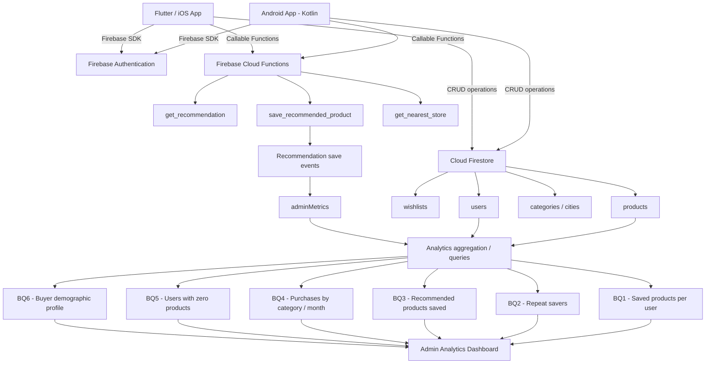
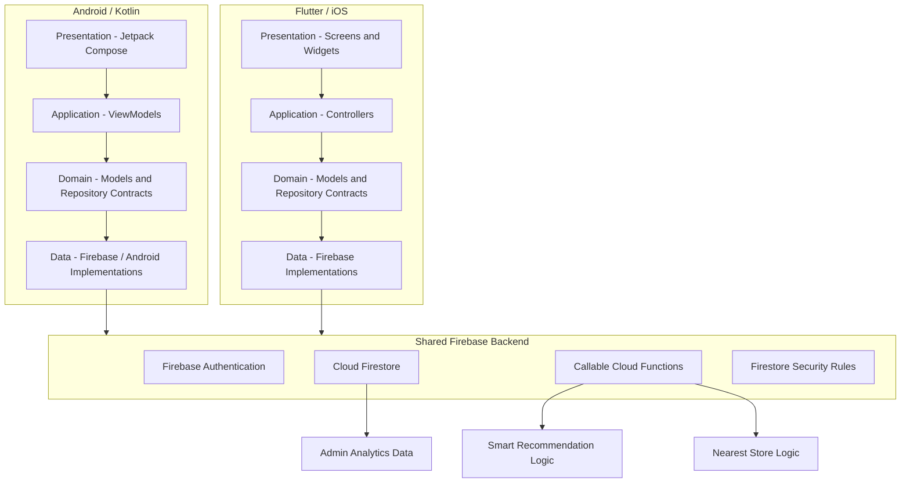

# Sprint 2 – App Implementation

**Course:** ISIS-3510 – Construcción de Aplicaciones Móviles  
**Team:** 13 – WhyNot  
**Members:** Juliana Duran, Santiago Casasbuenas, Martin Riveira, Jeronimo Franco, Juan Felipe Saenz, Miguel Angel Velandia  

---

## 1. Project Repositories

| Repository | Purpose | Link |
|---|---|---|
| Wiki | Course documentation and evidence | https://github.com/Moviles-G13-S1/wiki |
| Kotlin frontend | Native Android application | https://github.com/Moviles-G13-S1/whynot-front-kotlin |
| Flutter frontend | Flutter/iOS application | https://github.com/Moviles-G13-S1/whynot-front-flutter |
| Backend | Shared Firebase backend, rules, Cloud Functions and scripts | https://github.com/Moviles-G13-S1/whynot-back |


---

# 2. Business Questions

The following Business Questions are implemented as part of the Sprint 2 analytics functionality. The system uses application data stored in Firebase to calculate and expose these metrics through the administrator interfaces.

| # | Business Question | Type | Responsible member | Rationale | Main data source / implementation |
|---|---|---|---|---|---|
| BQ1 | How many products has a user saved? | Type 2 | *TBD* | Measures adoption and engagement with one of the core features of WhyNot and allows administrators to understand how actively users use their wishlists. | `products` collection grouped by `ownerId`; Admin Saved Products view. |
| BQ2 | How many users save another product after their first one? | Type 2 / Type 3 | *TBD* | Helps identify whether users continue interacting with the application after their first save and provides an indication of repeated engagement. | `products` collection grouped by `ownerId`; repeat-save analysis. |
| BQ3 | How many recommended products have been saved? | Type 3 | Juan Felipe Saenz | Measures whether the Smart Recommendation feature generates meaningful user actions instead of only displaying recommendations. | `get_recommendation` + `save_recommended_product`; recommendation events and `adminMetrics`. |
| BQ4 | Which category has the highest number of products marked as purchased per month? | Type 4 | *TBD* | Helps identify which product categories generate the highest purchasing activity over time and supports category-level analysis. | Purchased `products`, using `purchasedAt` and `categoryId`; Admin Purchases view. |
| BQ5 | How many users have 0 products saved? | Type 2 / Type 3 | *TBD* | Identifies registered users who have not yet adopted the application's main product-saving functionality and can be used as an activation indicator. | `users` collection compared with product owners; Admin Saved Products / Zero Products metric. |
| BQ6 | What is the demographic profile of the average buyer per category? | Type 4 | *TBD* | Helps characterize buyers by category using demographic information and purchasing activity, supporting a better understanding of the application's users. | Purchased products joined with user profiles; age, gender and city information. |

### 2.1 Changes from Sprint 1 BQs

The following questions correspond directly to questions already defined during Sprint 1:

- **BQ1:** How many products has a user saved?
- **BQ4:** Which category has the highest number of products marked as purchased per month?
- **BQ6:** What is the demographic profile of the average buyer per category?

For BQ2, BQ3 and BQ5, the final relationship with the Sprint 1 BQ list and/or the feedback that motivated the change must be documented here.

- **BQ2 change note:** *TBD*
- **BQ3 change note:** *TBD*
- **BQ5 change note:** *TBD*

---

# 3. Analytics Pipeline

WhyNot uses Firebase as the shared backend for both mobile applications. Operational data is generated by normal user interactions, stored in Firestore, and then processed either directly by the administrator repositories or by backend Cloud Functions depending on the Business Question.



### 3.1 Pipeline rationale

The analytics pipeline reuses the application's operational Firebase data instead of introducing a second database or analytics server. This keeps the architecture small enough for the project while allowing both mobile platforms to share the same definitions and backend data.

Most BQs are calculated from Firestore data available to authenticated administrator accounts. BQ3 is different because saving a recommendation must be distinguished from manually saving a product. For that reason, the recommendation save flow is handled through backend logic and updates a separate analytics metric.

*Additional pipeline rationale required by the team:* *TBD*

---

# 4. Architectural Design

## 4.1 Overall Architecture

WhyNot uses two independent mobile frontends connected to one shared Firebase backend. The applications share the same data contract, authentication model, Firestore collections, security rules, Cloud Functions and analytics definitions, while keeping platform-specific UI and device integrations separate.



## 4.2 Component interaction

A normal data operation follows the layered flow below:

```text
Screen / View
    ↓
Controller or ViewModel
    ↓
Repository interface
    ↓
Firebase repository implementation
    ↓
Firebase Authentication / Firestore / Cloud Function
```

Screens do not directly own the shared persistence logic. Instead, they delegate actions to an application-level controller or ViewModel, which uses repository contracts. This separation allows the application to replace Firebase implementations with fakes during tests and keeps backend-specific logic outside the UI layer.

For shared business behavior such as recommendations or nearby-store selection, the frontend repository calls the corresponding backend Cloud Function. The business rule is therefore implemented once in the backend instead of being duplicated independently in Kotlin and Flutter.

## 4.3 Patterns and architectural tactics

| Pattern / tactic | Where it is used | Rationale | Responsible member |
|---|---|---|---|
| Repository Pattern | Kotlin and Flutter data/domain layers | Separates domain contracts from Firebase implementations, improves testability and prevents screens from depending directly on Firebase SDK calls. | *TBD* |
| Layered / MVC-inspired architecture | Flutter features | Separates presentation, application/controller, domain and data responsibilities. | *TBD* |
| ViewModel-based presentation architecture | Kotlin features | Keeps UI state and application logic outside Compose screens and allows the UI to react to structured state. | *TBD* |
| Dependency Injection | `AppDependencies`, ViewModel factory and Flutter dependency scope | Centralizes the creation of repositories and makes it possible to replace real implementations with fakes during testing. | *TBD* |
| Authentication and authorization tactic | Firebase Authentication, custom `admin` claim, route guards and Security Rules | Restricts administrative functionality and sensitive data to authorized users. | *TBD* |
| Idempotency tactic | Recommendation-save flow | Prevents the same recommendation event from being counted more than once in BQ3. | *TBD* |
| Privacy / data minimization tactic | Nearby Store functionality | Device coordinates are used as transient input and are not stored in the user's profile. | *TBD* |
| Additional design pattern | *TBD* | *TBD* | *TBD* |

### 4.4 Architecture rationale

The architecture centralizes shared business logic and security in the Firebase backend while allowing each platform to preserve its native UI architecture. This prevents recommendation and context-aware algorithms from producing different results on each platform and provides one source of truth for the data contract.

Repository contracts reduce coupling between the UI and Firebase. Authentication and administrator authorization are implemented at both navigation and backend/security-rule levels rather than relying only on whether an Admin button is visible. The use of fake repositories in tests also improves testability without requiring Firebase initialization for every unit test.

*Additional rationale for course-specific architectural decisions:* *TBD*

---

# 5. Implemented Functionalities

The Sprint 2 implementation includes the following functionality across the two mobile platforms.

| Functionality | Kotlin / Android | Flutter / iOS | Backend / service involved | Responsible member(s) |
|---|---|---|---|---|
| User authentication | Implemented | Implemented | Firebase Authentication | *TBD* |
| User profile | Implemented | Implemented | Firestore `users` | *TBD* |
| Wishlist management | Implemented | Implemented | Firestore `wishlists` | *TBD* |
| Manual product creation and management | Implemented | Implemented | Firestore `products` | *TBD* |
| Mark product as purchased | Implemented | Implemented | Firestore `products`, `purchased`, `purchasedAt` | *TBD* |
| Admin analytics | Implemented | Implemented / final BQ mapping *TBD* | Firestore + `adminMetrics` | *TBD* |
| Sensor functionality: device location | Implemented | Implemented | Device location services | *TBD* |
| Context-Aware feature: Nearby Stores | Implemented | Implemented | `get_nearest_store` Cloud Function | *TBD* |
| Smart feature: demographic recommendation | Implemented | Implemented | `get_recommendation` Cloud Function | *TBD* |
| Save a recommended product | Implemented | Implemented | `save_recommended_product` Cloud Function | Juan Felipe Saenz / *TBD for frontend ownership* |
| Type 2 BQ functionality | Implemented | Implemented / evidence *TBD* | Firestore analytics | *TBD* |
| External/backend-connected functionality different from authentication | Implemented | Implemented | Firebase callable Cloud Functions | *TBD* |
| Voice input / speech recognition | Implementation exists in Kotlin; final merged status *TBD* | *TBD* | Android SpeechRecognizer | *TBD* |

## 5.1 Minimum Sprint functionality mapping

| Sprint requirement | WhyNot implementation | Evidence |
|---|---|---|
| Uses at least one phone sensor | Device location used by Nearby Stores | *TBD – add file/PR/demo link* |
| Answers Type 2 BQs | BQ1 / BQ2 / BQ5 analytics | *TBD – add file/PR/demo link* |
| Context aware | Nearby Stores adapts results using the user's current location | *TBD – add file/PR/demo link* |
| Smart feature | Product recommendation based on demographic similarity | *TBD – add file/PR/demo link* |
| User authentication | Email/password registration and login using Firebase Authentication | *TBD – add file/PR/demo link* |
| External service / backend connection | Recommendations and Nearby Stores call Firebase Cloud Functions | *TBD – add file/PR/demo link* |

---

# 6. Views Implemented by Each Member

Each member must be able to present, justify and explain at least one view implemented in the application.

| Member | Platform | View implemented | Evidence |
|---|---|---|---|
| Juliana Duran | *TBD* | *TBD* | *TBD* |
| Santiago Casasbuenas | *TBD* | *TBD* | *TBD* |
| Martin Riveira | *TBD* | *TBD* | *TBD* |
| Jeronimo Franco | *TBD* | *TBD* | *TBD* |
| Juan Felipe Saenz | Kotlin / Android | *TBD* | *TBD* |
| Miguel Angel Velandia | *TBD* | *TBD* | *TBD* |

---

# 7. Individual Contribution Mapping for Viva Voce

This table should be completed before the oral exam so that every team member can clearly identify the elements they are expected to explain.

| Member | BQ | View | Functionality | Architectural contribution | Design pattern | Evidence |
|---|---|---|---|---|---|---|
| Juliana Duran | *TBD* | *TBD* | *TBD* | *TBD* | *TBD* | *TBD* |
| Santiago Casasbuenas | *TBD* | *TBD* | *TBD* | *TBD* | *TBD* | *TBD* |
| Martin Riveira | *TBD* | *TBD* | *TBD* | *TBD* | *TBD* | *TBD* |
| Jeronimo Franco | *TBD* | *TBD* | *TBD* | *TBD* | *TBD* | *TBD* |
| Juan Felipe Saenz | BQ3 – Recommended products saved | *TBD* | Recommendation-save analytics / *TBD* | *TBD* | *TBD* | Backend PR #7 + *TBD* |
| Miguel Angel Velandia | *TBD* | *TBD* | *TBD* | *TBD* | *TBD* | *TBD* |

---

# 8. Ethics Video

**Required duration:** approximately 6 minutes.  
**Video link:** *TBD*  
**Slides / supporting material:** *TBD*  

The video should discuss ethical considerations associated with the functionality implemented during this sprint, especially topics related to user data, demographic recommendations, location, authentication, administrator access and analytics.

---

# 9. Collaboration and Repository Evidence

The project uses GitHub repositories and collaboration mechanisms to coordinate work across both mobile platforms and the shared backend.

## 9.1 Required evidence

- Issues used to assign and track work: *TBD – add link*
- GitHub Project / Kanban board: *TBD – add link*
- Sprint 2 milestone: *TBD – add link*
- Pull Requests: *TBD – add representative PR links*
- Pull Request reviews / approvals: *TBD – add links*
- Descriptive commits: *TBD – add examples*
- Evidence of contributions from all six members: *TBD*

## 9.2 Relevant implementation PRs already identified

- Kotlin PR #14 – BQ2, BQ5, Nearby Stores and Recommendations.
- Kotlin PR #13 – BQ4, BQ6 and related admin/location/recommendation integration.
- Backend PR #7 – tracking saved recommended products for BQ3.
- Backend PR #9 – nearest-store Cloud Function.
- Flutter PR #10 – users with zero saved products in admin analytics.
- Flutter PR #13 – recommended-products admin metric integration.
- *TBD – add remaining PRs that provide evidence for each member.*

---

# 10. Testing and Validation

## Kotlin / Android

Existing automated tests include ViewModel tests for administrator analytics, Nearby Stores and Recommendations using fake repositories.

**Final test command/result:** *TBD*  
**Number of passing tests:** *TBD*  
**Build evidence:** *TBD*  

## Flutter / iOS

The Flutter project includes controller, repository and widget tests using in-memory/fake implementations.

**Final test command/result:** *TBD*  
**Number of passing tests:** *TBD*  
**Build evidence:** *TBD*  

## Backend

The backend includes Firestore Security Rules tests and scripts for validating the Smart and Context-Aware features.

**Final test command/result:** *TBD*  
**Number of passing tests:** *TBD*  
**Deployment evidence:** *TBD*  

---

# 11. Final Submission Checklist

- [ ] All 6 BQs are listed with type, rationale and responsible member.
- [ ] BQ changes from Sprint 1 are explained where necessary.
- [ ] Analytics Pipeline diagram is included.
- [ ] Analytics Pipeline rationale is complete.
- [ ] Overall architecture diagram is included.
- [ ] Component interaction is explained.
- [ ] Design patterns and architectural tactics are listed.
- [ ] Every pattern/tactic has a responsible member.
- [ ] Every architecture diagram has a rationale.
- [ ] Implemented features are listed for both platforms.
- [ ] Every functionality has responsible member(s).
- [ ] Every member has at least one view to present.
- [ ] Every member has a BQ to explain.
- [ ] Every member has an architectural contribution and design pattern to explain.
- [ ] Sensor functionality is demonstrated.
- [ ] Type 2 BQ functionality is demonstrated.
- [ ] Context-Aware feature is demonstrated.
- [ ] Smart feature is demonstrated.
- [ ] Authentication is demonstrated.
- [ ] A non-authentication feature connected to the backend is demonstrated.
- [ ] Ethics video link is included.
- [ ] Issues, milestones, Project/Kanban and PR evidence are included.
- [ ] PR reviews/approvals are visible as collaboration evidence.
- [ ] Final tests/builds for Kotlin, Flutter and backend are recorded.
- [ ] All remaining `TBD` fields have been reviewed before submission.

---

# 12. References

- WhyNot Wiki: https://github.com/Moviles-G13-S1/wiki
- Kotlin frontend: https://github.com/Moviles-G13-S1/whynot-front-kotlin
- Flutter frontend: https://github.com/Moviles-G13-S1/whynot-front-flutter
- Backend: https://github.com/Moviles-G13-S1/whynot-back
- Architecture documentation: https://github.com/Moviles-G13-S1/whynot-docs
- Figma prototype: https://www.figma.com/design/GKjDHU7klmjGONACLHfg0O/WhyNot-IOS
- Ethics video: *TBD*
